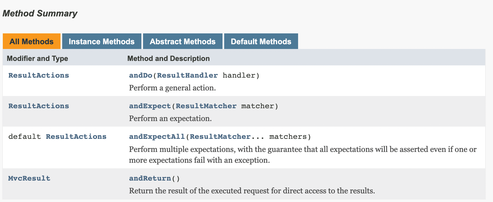

### ResultActions

MockMvc 메소드 중 하나로 요청을 수행하고 액션들을 체인으로 연결해 예상 값이나 결과값을 리턴 받는 인터페이스다. 

### ResultActions 메소드

ResultActions는 인터페이스로 총 3개의 메소드로 구성되어있다.



1.  [ResultActions] andDo: 어떤 동작을 수행할 때 사용
    
    ```java
    ResultActions resultActions = mvc
    				.perform(
    						post("/member/login")
    								.content("""
                             {
                                  "username": "user1",
                                  "password": "1234"
                             }
                             """.stripIndent())
    								.contentType(new MediaType(MediaType.APPLICATION_JSON, StandardCharsets.UTF_8))
    				)
    				.andDo(print());
    ```
    
2. [ResultActions] andExpect: 결과값을 예상
    
    ```java
    resultActions
    				.andExpect(status().is2xxSuccessful());
    ```
    
3. [MockMvc] andReturn: 요청을 실행한 결과를 MvcResult 타입으로 리턴
    
    ```java
    MvcResult mvcResult = resultActions.andReturn();
    ```
    

**`참고자료`**

- https://docs.spring.io/spring-framework/docs/current/javadoc-api/org/springframework/test/web/servlet/ResultActions.html
- https://donghyeon.dev/spring/2019/03/28/Spring-%EC%BB%A8%ED%8A%B8%EB%A1%A4%EB%9F%AC-%ED%85%8C%EC%8A%A4%ED%8A%B8%EB%A5%BC-%EC%9C%84%ED%95%9C-MockMvc/