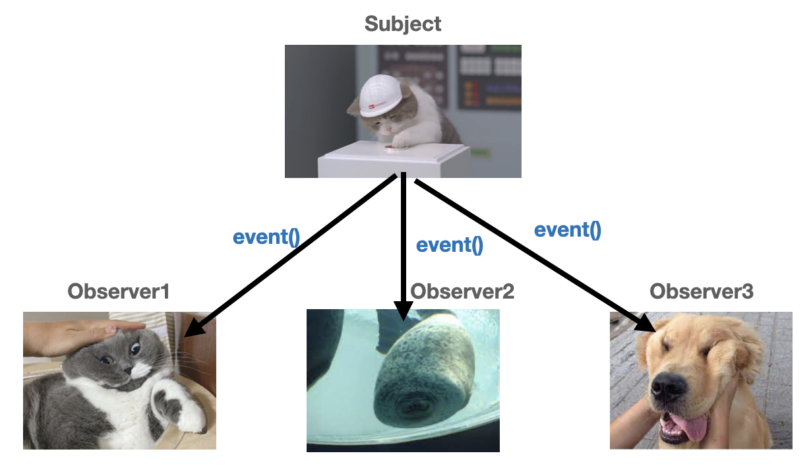

### 옵저버 패턴


#### 옵저버 패턴이란?

GoF 디자인 패턴 중 행위 패턴에 해당되는 패턴으로 어느 객체(Subject)가 변할 때 관련 객체들(Observer)이 그 변화를 통지 받고 자동으로 갱신하는 디자인 패턴이다. 위의 그림을 예시로 든다면 객체가 버튼을 눌리게 된다면 해당 이벤트를 관련 옵저버 객체들로 전달하게 되고 그에 해당하는 동작을 하게 만든다.

#### 옵저버 패턴을 사용하는 이유

만일 옵저버 패턴을 사용하지 않는다면 아래의 코드는 굉장히 복잡해진다. 모든 객체를 받아올 수 있게 Object로 선언 해주고 해당 객체에게 이벤트 정보를 보낼려면 해당 객체가 어떠한 형태인지 모른다. 따라서 일일이 관련 객체에 접근해 하나하나 해당 이벤트를 알려줘야하는 수고스러움이 발생한다.

```java
// 옵저버 패턴이 없는 코드
class Subject{
		// 2. 찌부될 객체가 맴버변수로 저장
    private Object pressEventListener;

		// 1. 찌부될 객체를 들고온다. (초기화)
    public void setClickEventListener(Object event) {
        this.pressEventListener = event;
    }

		// 3. 찌부될 객체에게 알려줘..야하는데 일일이 다보내야하나?
    public void press() {
        pressEventListener...? //누굴 찌부시켜야해
    }
}

class 찌부될고양이{
    void pressed(){
        System.out.println("냐...냐옹...");
    }
}

class 찌부될개{
    void pressed(){System.out.println("ㅁ ...멍...ㅇ..");}
}

class 찌부될물개{
    void pressed(){System.out.println("ㄲ ...꾸루룩");}
}
```

위와 같은 문제를 하나의 인터페이스로 각각의 클래스들을 묶는다면 해결할 수 있다. 인터페이스로 Subject 클래스의 이벤트를 받을 수 있는 추상 메서드를 선언한다면 이를 상속한 하위 클래스들은 Subject 클래스의 이벤트를 받을 수 있는 메서드를 가지게 된다.

Subject 클래스엔 인터페이스를 선언해주며, 어떤 클래스에게 이벤트를 전달해야될지 알 필요 없이 해당 인터페이스를 가진 클래스한테만 이벤트를 전달할 수 있다.

```java
// 옵저버 패턴 코드
class Subject{
		// Object 대신 Listener 인터페이스로
    private Listener pressEventListener;
		
    public void setClickEventListener(Listener event) {
        this.pressEventListener = event;
    }
		// Listener 인터페이스의 list() 메서드 호출
    public void press() {
				listener.listen();
    }
}

interface Listener{
    void listen();
}

class 찌부될고양이 implements Listener{
		public void listen(){
        pressed();
    }
    void pressed(){
        System.out.println("ㄴ...냐...옹...");
    }
}

class 찌부될개 implements Listener{
		public void listen(){
        pressed();
    }
    void pressed(){System.out.println("ㅁ ...멍...ㅇ..");}
}

class 찌부될물개 implements Listener{
		public void listen(){
        pressed();
    }
    void pressed(){System.out.println("ㄲ ...꾸루룩...");}
}
```

#### 옵저버 패턴의 장단점

##### 장점  

1. 느슨한 결합
    
    두 객체가 상호작용을 하지만 서로에 대해서 잘 모른다.  
    중간에서 인터페이스가 알아서 해결해주기 때문이다.
    

##### 단점

1. 옵저버 객체에게 알림이 가는 순서를 보장할 수 없다.
2. 서로간의 관계가 잘정의 되지 않았으면 원하지 않은 동작 발생