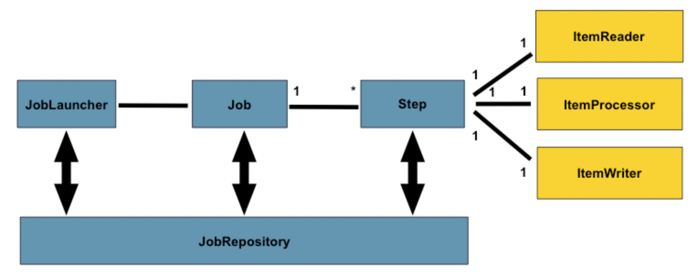
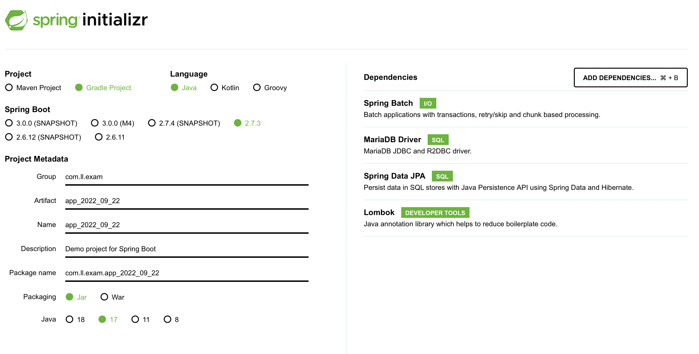
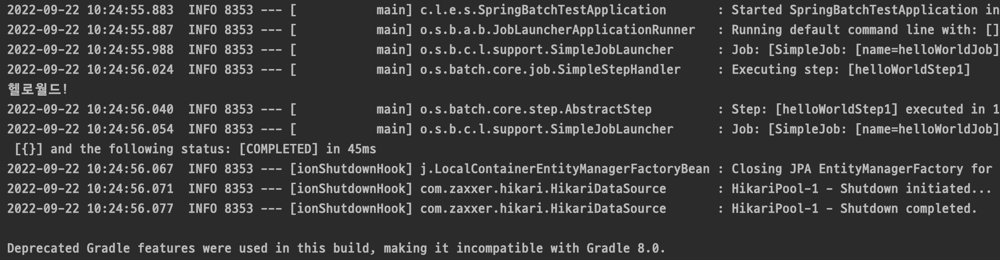

### Batch란

대용량의 데이터를 실시간으로 처리하는 것이 아니라 일괄적으로 모아서 작업하는 것을 배치 작업이라고 한다. 예를 들어 로그인은 각각 개별적인 처리를 하는 것이 효율적이지만 모든 회원에게 메일을 보내는 작업은 일괄적으로 처리하는 것이 효율적이다. 이렇듯 배치 작업은 일반적으로, 정해진 시간에 대량의 데이터를 일괄적으로 처리한다라고도 정의할 수 있다.

#### Spring Batch 구조



- JobRepostitory나 JobLauncher는 건드리지 않아도 된다.
- job이나 step, 하위 클래스들을 개발한다.
- job은 여러개의 step들로 구성된다.
- job은 똑같은 조건이면 다시 실행되지 않는다.
    - 예를들어 한번 실행했던 작업이 있다면 그 정보를 따로 저장해 재실행 여부를 정한다.

#### Batch 주요 용어

1. **Job**
    
    실행시킬 작업을 의미로, 논리적인 Job 실행의 개념이다.
    
2. **batch 메타 테이블**
    - spring batch가 제공하는 가장 기본적인 기능
    - 배치 작업 하는동안 사용되는 모든 메타정보들을 저장
        - 예를들어 작업시간, 파라미터, 정상수행 여부
    - 이를 통한 모니터링 용도로 사용가능
3. **Step**
    
    Job 내부에서 수행될 1개의 step
    


#### 🌟Tasklet vs Chunk
간단하게는 Tasklet, 스프링배치는 Chunk 지향

- Task 기반: 하나의 작업 기반으로 실행
- Chunk 기반: 하나의 큰 덩어리를 n번씩 나눠서 실행


#### 배치 실습 환경


#### 배치앱으로 등록

@EnableBatchProcessing 애너테이션을 꼭 붙여줘야지 작업이 진행된다. 

```java
@SpringBootApplication
@EnableBatchProcessing
public class SpringBatchTestApplication {

	public static void main(String[] args) {
		SpringApplication.run(SpringBatchTestApplication.class, args);
	}

}
```

#### 배치 Job을 생성

```java
@Configuration
@RequiredArgsConstructor
public class HelloWorldJobConfig {

    @Autowired
    private JobBuilderFactory jobBuilderFactory;

    @Autowired
    private StepBuilderFactory stepBuilderFactory;

    @Bean
    public Job helloWorldJob() {
        return jobBuilderFactory.get("helloWorldJob")
                .start(helloWorldStep())
                .build();
    }

    @JobScope
    @Bean
    public Step helloWorldStep1() {
        return stepBuilderFactory.get("helloWorldStep1")
                .tasklet(helloWorldTasklet())
                .build();
    }

    @StepScope
    @Bean
    public Tasklet helloWorldTasklet() {
        return new Tasklet() {
            @Override
            public RepeatStatus execute(StepContribution contribution, ChunkContext chunkContext) throws Exception {
                System.out.println("스프링 배치");
                return RepeatStatus.FINISHED;
            }
        };
    }
}
```

#### ${job.name} 의미

Job 의 환경변수명을 참조하는 구문이다. 만일 없다면 조건을 걸어줄 수 있는데 이번 HelloWorld 실습에선 helloworldJob을 적어줬다.

```yaml
spring:
  batch:
    job:
      names: ${job.name:helloWorldJob}
    jdbc:
      initialize-schema: ALWAYS
  datasource:
    url: jdbc:mariadb://127.0.0.1:3306/app_2022_09_22?useUnicode=true&characterEncoding=utf8&autoReconnect=true&serverTimezone=Asia/Seoul
    driver-class-name:
    username: root
    password: roger3495
  jpa:
    show-sql: true
```  

#### 결과화면
  

  
#### 참고

[SpringBoot Batch 정리](https://velog.io/@mooh2jj/SpringBoot-Batch)