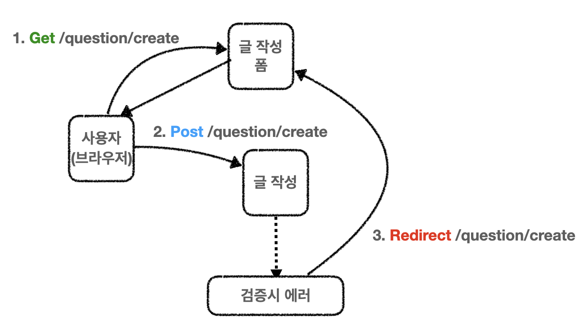

#### SpringBoot Validation

폼으로 값을 받아오는 경우가 웹사이트에선 거의 필수적으로 존재하는데 이럴 때마다 해당 값이 유효한지를 검사해줘야한다. 아래의 직접👀 그린 그림을 그런 수많은 경우 중에 글을 작성할 때 동작 과정을 간단하게 구조도처럼 그려봤다.



1. 사용자는 Get 메서드를 통해 글 작성 폼의 페이지를 요청한다.
    1. 서버는 글 작성 폼을 사용자에게 보여주며 응답한다.
2. 글 작성 폼을 받은 사용자는 변경될 내용을 폼에게 Post 메서드로 요청한다.
    1. **이때 사용자가 유효한 값(올바른 값)을 입력했는지 검증한다.**
3. 만일 검증시 에러가 발생하게 되면 Redirect로 폼으로 돌아가게 반환해준다.

이때 검증시 때 유용하게 사용할 수 있는게 **BindingResult** 클래스이다.

#### BindingResult

BindingResult를 만일 쓰지 않았다면 아래와 같은 코드를 작성해야한다. Question 작성 폼에서 Subject와 Content를 받아오면 둘 다 null값은 아닌지, 해당 문자 길이가 얼마인지를 일일이 if문을 덕지덕지 써가며 검사를 해야할 것이다. 이는 펀하고 쿨하고 섹시하게 코딩하는 방식이 아니다.(개인적인 사견)

```java
	@PostMapping("/create")
    public String questionCreate(Model model, QuestionFrom questionFrom) {
        if (questionFrom.getSubject() == null || questionFrom.getSubject().trim().length() == 0) {
            model.addAttribute("errorMsg", "제목 좀...");
            return "question_form";
        }

        if (questionFrom.getContent() == null || questionFrom.getContent().trim().length() == 0) {
            model.addAttribute("errorMsg", "내용 좀...");
            return "question_form";
        }

        questionService.create(questionFrom.getSubject(), questionFrom.getContent());
        return "redirect:/question/list"; // 질문 저장후 질문목록으로 이동
```

BindingResult는 해당 에러들을 다 담은 바구니라고 생각하면 된다. 아래의 어노테이션들을 달아주게 되면 BindingResult에서 에러들을 판단하고 우리는 BindingResult에 에러가 있는지만 확인해주면 검증을 할 수 있다. 

```java
	@PostMapping("/question/create")
    public String questionCreate(@Valid QuestionForm questionForm, BindingResult bindingResult) {
        // 만약 폼에서 받아온 데이터가 오류가 있다면?
        if (bindingResult.hasErrors()){
            return "question_form";
        }
        this.questionService.create(questionForm.getSubject(),questionForm.getContent());
        return "redirect:/question/list"; // 질문 저장후 질문목록으로 이동
    }
```

#### 💡 Tip‼️
BindingResult 매개변수는 항상 @Valid 매개변수 바로 뒤에 위치해야 한다. 만약 2개의 매개변수의 위치가 정확하지 않다면 @Valid만 적용이 되어 입력값 검증 실패 시 400 오류가 발생한다.

#### Validation의 유용한 어노테이션    


출처: [https://wikidocs.net/161873](https://wikidocs.net/161873)