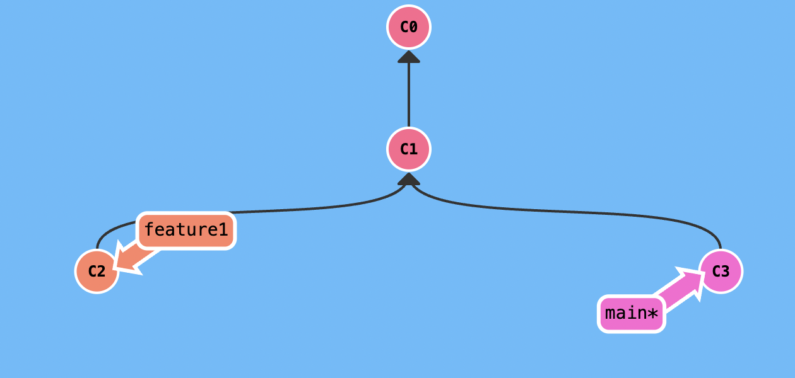
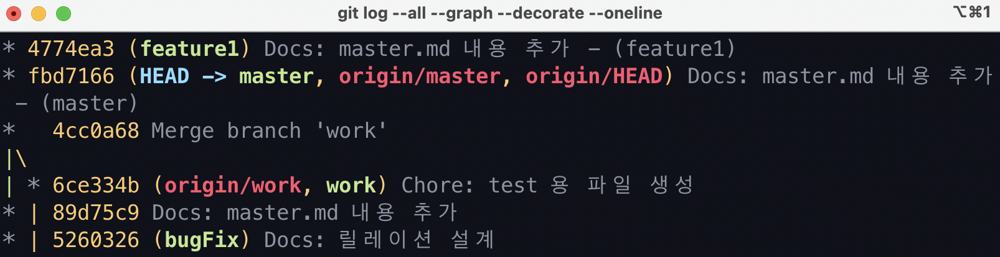
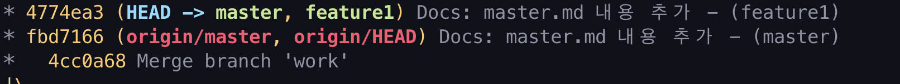

### conflict란?

보통 서로 같은 파일을 수정했을 때 발생하는 것으로 흔히 conflict, 충돌이라고 한다. merge나 rebase란 개념에선 고려하지 않는다면 자주 일어날 수도 있는 일이다.

### Rebase를 이용한 Conflict 예시

아래와 같이 현재 상황은 다음과 같다.

1. feature1과 main 브렌치를 만든다.
2. master.md 파일의 같은 줄에 수정을 했다.
3. 각각의 브렌치 별로 커밋을 한 상태

### 이후 rebase

이후 feature1에서 `rebase main` 을 진행하게 되면 아래와 같이 충돌이 일어나면서 다음 파일 수동으로 병합해야한다는 내용을 보여준다.

### 해결

수동으로 파일을 수정한 다음 `rebase --continue` 를 하게 되면 feature1의 복사본이 main 앞으로 향하게 된다. 

이제 main 브렌치로 이동해 `rebase feature1` 를 하면 아래와 같이 git log가 깔끔해진 것을 확인할 수 있다.

