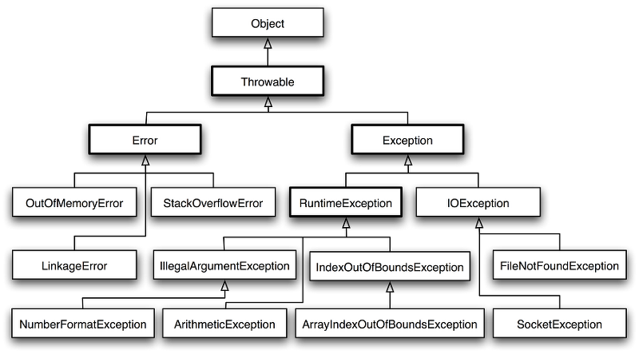

## 들어가며

프리코스 최종 테스트를 준비하는 마음으로 프로그래밍을 할때 생각해야할 부분을 글로 정리해보는게 좋을 것 같아 글을 작성하게 됐다. 크게 예외처리, 클래스, 메서드, 입출력, 테스트 코드 작성 시 고려해야할 부분과 기준점을 세워 보다 효율적이게 코딩해본다.

## 예외처리

### 예외처리 위치

- 입력 요구사항 → InputView에서 예외 발생
- 도메인 요구사항 → 클래스 생성할 때 생성자에서 validation

### 예외 메시지

- 예외를 던지는 클래스에 상수로 정의
- 표준 예외를 사용한다.
    
    
    

### 숫자 검증

```java
private Integer toInteger(String number) {
    try {
        return Integer.valueOf(number);
    } catch (NumberFormatException e) {
        throw new IllegalArgumentException(INVALID_NUMBER_FORMAT_MESSAGE);
    }
}
```

- 이미 만들어져있는 `Integer.valueOf()`나 원시값이 필요하다면 `Integer.parseInt()` 사용하여 `NumberFormatException`을 잡아 적당한 예외로 전환한다.
- 정규표현식도 좋은 방법이지만 자바에서 기본적으로 제공하는 것을 사용하면 적절한 정규식을 찾는 시간을 단축할 수 있다.

### 정규표현식

- Pattern은 상수화해 재사용에 용이하도록 한다.
    - `Pattern pattern = Pattern.compile("[가-힇0-9a-zA-Z]+");`

## 클래스

### 클래스 나누기

- 단일 책임 원칙을 가지도록 생각한다.
    - 하나의 클래스는 하나의 책임을 지녀야한다.
    - 예) 로또 번호 리스트(일급 컬렉션) → 로또(일급 컬렉션) → 로또 번호(원시값 포장한 클래스)
- 일급 컬렉션 참고자료
    - [https://jojoldu.tistory.com/412](https://jojoldu.tistory.com/412)

### 값 타입

- 도메인 객체는 DTO 또는 VO로 값을 주고 받아야한다.
- 타입을 비교하려면 equals & hashcode로 동일성과 동등성을 체크한다.

### 인스턴스 캐싱

- 반복적으로 사용되는 인스턴스는 캐싱한다.
- 참고자료
    - [https://tecoble.techcourse.co.kr/post/2020-06-24-caching-instance/](https://tecoble.techcourse.co.kr/post/2020-06-24-caching-instance/)

### Enum 활용

- 내부에 상태를 확인하는 메서드를 만들어둔다면 더 객체스럽게 사용 가능하다.
- Enum을 사용하는 Map이 필요한 경우 EnumMap을 사용한다.

```java
public enum BridgeGameStatus {
    PLAY("R"),
    STOP("Q");

    private static final String INVALID_COMMAND_MESSAGE = "R과 Q 중 하나의 값을 입력해주세요.";

    private final String command;

    BridgeGameStatus(String command) {
        this.command = command;
    }

    public boolean isPlayable() {
        return this.equals(PLAY);
    }

    public boolean isNotPlayable() {
        return this.equals(STOP);
    }

    public static BridgeGameStatus gameStart() {
        return PLAY;
    }

    public static BridgeGameStatus from(String command) {
        return Arrays.stream(values())
                .filter(status -> status.command.equals(command))
                .findFirst()
                .orElseThrow(() -> new IllegalArgumentException(INVALID_COMMAND_MESSAGE));
    }
}
```

## 메서드

### 스트림 활용

- 스트림을 활용하면 메서드 길이도 줄이고 가독성도 개선할 수 있다.
- 스트림 생성
    - `Stream.generate()` → 예) `Stream.generate(bridgeNumberGenerator::generate)`
    - `IntStream.range()`, `IntStream.rangeClosed()`
    - Enum → `Arrays.stream(values())`
    - 컬렉션을 이용한 스트림 생성
- 중간 연산
    - limit → 크기 제한
    - map, mapToObj → 변환
    - filter → 필터링
    - findFirst, findAny → 필터링 후 일치하는 요소 하나만 가져오기
    - distinct → 중복 제거
- 최종 연산
    - collect(toList()) → 가장 많이 사용
    - collectingAndThen → collect로 수집 후 객체 생성할 때

## 출력

• 포맷팅한 문자열을 상수로 정의한 후 `MessageFormat.format`을 이용하면 출력에 필요한 라인 수를 줄일 수 있다.

```java
// 4주차 다리 건너기 출력 예시
private static final String MAP_MESSAGE_FORMAT = "[ {0} ]";
private static final String MAP_MESSAGE_DELIMITER = " | ";

private String getResultMessage(List<MoveResult> moveResults) {
    return format(MAP_MESSAGE_FORMAT, moveResults.stream()
            .map(출력값으로변환하는메서드())
            .collect(Collectors.joining(MAP_MESSAGE_DELIMITER))
    );
}
```

## TDD

### 테스트 대상

- public 메서드 경우만 테스트
- 생성자도 validation이 있어 예외를 던지는 경우 테스트한다.

### 여러 개 테스트

- 테스트를 반복 하고 싶다면 `@ParameterizedTest` 활용한다.
    - 입력이 하나인 경우 `@ValueSource`
    - 여러개인 경우 `@CsvSource`, `@MethodSource`를 사용한다.

### 테스트 메서드 네이밍

- 기본적으로 무슨 메서드를 무엇을 테스트하는지 영어로 작성한다.
    - 테스트할메서드_테스트할내용()
- `@Display` 로 테스트 메서드가 보일 문구를 작성한다.
- 이때 문구는 테스트 대상의 행동으로 작성한다.

## 참고

[https://github.com/woowacourse-precourse/community/discussions/1706#top](https://github.com/woowacourse-precourse/community/discussions/1706#top)