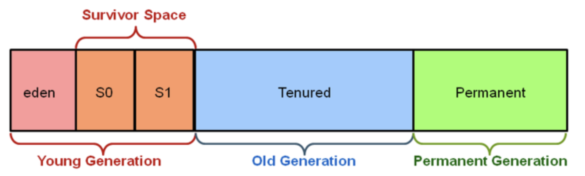
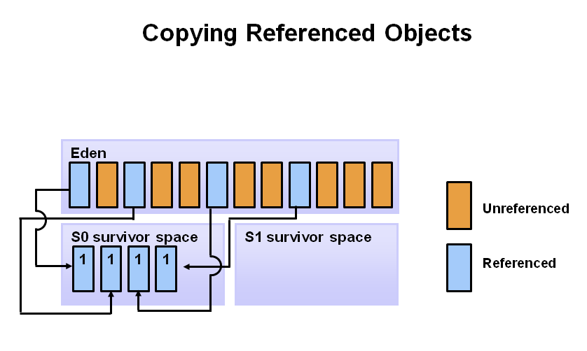
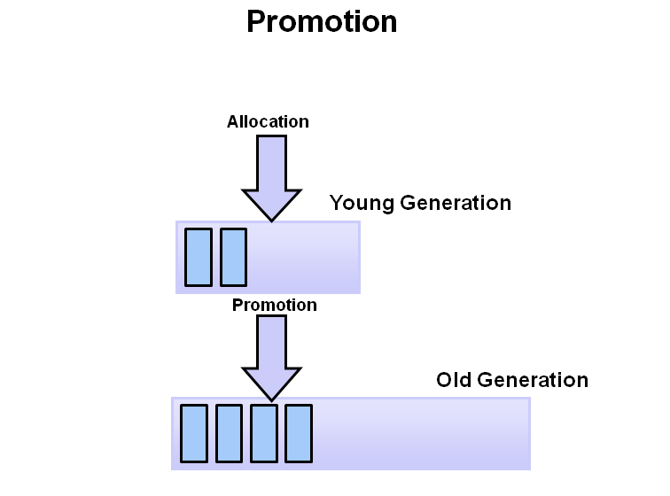

### 들어가며

메모리 주소 접근이 가능한 C언어는 Heap에서 불필요한 메모리를 차지하는 녀석들을 직접 free()란 명령어로 메모리 할당을 해제해줄 수 있다. 하지만 자바에선 개발자가 직접 메모리 할당을 해제해주는 명령어를 찾아볼 수 없다. 그 이유는 JVM은 가비지 콜렉터가 불필요한 메모리들을 해제시켜주기 때문이다. 이번 글에선 가비지 콜렉터가 수행하는 가비지 컬렉션을 다뤄볼까 한다.

### 가비지(Garbage)

말그대로 쓰레기다…! 프로그램에서 변수들은 각각의 정보를 저장할 주소를 할당받는다. 이때 지역변수처럼 Stack 지역 안에 있는 변수는 함수가 실행이 완료되면 그와 같이 변수들이 할당받은 메모리 공간을 해제 되는데 Heap 영역안에서 동적으로 메모리 공간을 할당받은 변수들은 그렇지 않는다. 이때 그 가비지, 즉 사용하지 않는 변수들을 가비지라고 한다. 

Stack 메모리 영역에서 Person 클래스로 person이란 참조 변수를 생성하면서 이름이 “John”인 객체를 힙에 만든다. 이때까지는 John 이름을 가진 객체는 누구에게 참조되어지고(가르켜지고) 있기 때문에 가비지가 없다. 하지만 후자처럼 “John”을 가르키고 있던 변수가 다른 객체를 가르키게되면  더이상 “John” 이름을 가진 객체는 사용되어지지 않는다. 이를 어떤 경로로도 닿지 않는 상태라고 하며 `**Unreachable 상태`** 라고 한다. 이런 객체들은 사용되어 지지 않으며 메모리를 차지하고 있다고 판단돼 GC가 메모리 공간을 회수 한다. 아래는 GC 대상이 되는 오브젝트들이다.

- 모든 객체 참조가 null인 경우
- 객체가 블럭 안에서 생성되고 블럭이 종료된 경우
- 부모 객체가 null이 된 경우, 자식 객체는 자동적으로 GC 대상
- 객체가 Weak 참조만 가지고 있을 경우
- 객체가 Soft 참조이지만 메모리 부족이 발생한 경우

### 기본 GC 동작 과정

#### Stop the world

GC(가비지 컬렉션) 실행을 하기 위해 JVM이 잠시 애플리케이션 샐행을 멈추는 동작을 말한다. 모든 GC가 하는 동작으로 GC를 실행하는 쓰레드를 제외한 모든 쓰레드의 작업을 멈춘다. 예를들어 카페에서 화장실 청소를 할 때, 입구 앞에 “청소 중" 이란 팻말을 세워놓고 화장실 출입을 통제하고 청소를 진행하는 것과 같다. 

추후에 GC를 하는 방법은 여러 알고리즘이 있지만 stop the world 를 한 다음 여러 방법(알고리즘)을 진행한다. 대부분 JVM에서 GC 튜닝이라 함은 이 stop the world 시간을 줄이는 것을 뜻한다.

#### Marking

마킹(Marking)이란 쉽게 말해 GC에 의해 삭제되지 않을 오브젝트들을 선택하는 것이다. GC에는 GC Root라는 것이 있는데 힙 외부에서 접근할 수 있는 변수나 오브젝트를 뜻한다. 프로세스는 GC Root가 참조하는 이 Root가 참조하는 모든 객체들을 탐색해 내려가면서 마킹을 하고 마킹된 객체들을 호출한다. 모든 오브젝트는 마킹 단계에서 결정을 위해 스캔되어지는데 이때 매우 많은 시간이 소모된다.

#### Normal Deletion

참조되지 않는 오브젝트를 제거하고, 메모리를 반환하는 과정이다. 메모리 Allocator는 반환되어 빈 블럭들의 참조 위치를 저장해 두었다가 새로운 오브젝트가 선언되면 할당되도록 해준다.

#### Compacting

퍼포먼스를 향상시키기 위해, 남은 참조되어지는 오브젝트들을 묶는 과정이다. 이들을 묶음으로서 공간이 생기므로 새로운 메모리 할당 시에 더 쉽고 빠르게 진행 할 수 있다.

### Generational Garbage Collection 배경

위와 같은 과정을 `Mark & Compact`이라고 칭하는데 이런 JVM은 비효율적이다. 다음과 같은 그래프를 보면 더 이해가 잘될 것이다.

Y축은 할당된 바이트의 수이고 X축은 바이트가 할당될 때의 시간이다. 보다시피 시간이 갈수록 적은 객체만이 남는 것을 알 수 있는데 이런 그래프에 기반한 것이 Week Generation Hypothesis이다.

### Week Generation Hypothesis

자바에서 GC는 두 가지 가설(전제 조건) 하에 만들어졌다.

- 대부분의 객체는 금방 접근 불가능 상태(unreachable)가 된다.
- 오래된 객체에서 젊은 객체로의 참조는 아주 적게 존재한다.

이러한 가설에 기반하여 자바는 Young 영역과 Old 영역으로 메모리를 분할하고, 신규로 생성되는 객체는 Young 영역에 보관하고, 오랫동안 살아남은 객체는 Old 영역에 보관한다.

### Generational Garbage Collection

#### Young 영역(Young Generation 영역)

새롭게 생성한 객체의 대부분이 이 영역에 위치한다. 대부분의 객체가 금방 접근 불가능 상태가 되기 때문에 매우 많은 객체가 Young 영역에 생성되었다가 사라진다. 이 영역에서 객체가 사라질때 `Minor GC` 가 발생한다고 말한다. 

#### Old 영역(Old Generation 영역)

접근 불가능 상태로 되지 않아 Young 영역에서 살아남은 객체가 여기로 복사된다. 대부분 Young 영역보다 크게 할당하며, 크기가 큰 만큼 Young 영역보다 GC는 적게 발생한다. 이 영역에서 객체가 사라질 때 `Major GC(혹은 Full GC)` 가 발생한다고 말한다.

#### Permanet 영역

Method Area라고도 한다. JVM이 클래스들과 메소드들을 설명하기 위해 필요한 메타데이터들을 포함하고 있다. JDK8부터는 PermGen은 Metaspace로 교체된다.

### Generational GC 동작 과정

Generational Garbage Collection를 이해하기 위해서는 좀 더 Young 영역을 더 자세히 알아볼 필요가 있다. Young 영역은 3개의 영역으로 나뉜다.

- Eden 영역
- Survivor 영역(2개)

Survivor 영역이 2개이기 때문에 총 3개의 영역으로 나뉘는 것이다. 각 영역의 처리 절차를 순서에 따라서 기술하면 다음과 같다.

1. 어떠한 새로운 객체가 들어오면 Eden Space에 할당한다.
    
    
    
2. Eden Space가 가득차게 되면, Minor GC가 시작된다.
    
    
    
3. 참조되는 객체들은 첫번째 Survivor(S0)로 이동되어지고, 비 참조 객체는 Eden 공간이 clear 될 때 반환된다.
    
    
    
4. Minor GC 때, Eden Space에서는 다음과 같은 일이 일어난다. 비 참조 객체는 삭제되고 참조 객체는 survivor space로 이동한다. 그러나 이 케이스에서는 참조 객체는 두 번째 survivor space로 이동하게 된다. 게다가 최근 Minor GC에서 첫 번째 survivor space로 이동된 객체들도 age가 증가하고 S1 공간으로 이동하게 된다. 한번 모든 surviving 객체들이 S1으로 이동하게 되면 S0와 Eden 공간은 clear 된다. 주의해야할 점은 이제 우리는 다른 age를 가진 객체들을 survivor 공간에 가지게 된다.
    
    
    
5. 다음 minor GC 때, 같은 과정이 반복 된다. 그러나 이 번엔 survivor space들은 switch 된다. 참조되는 객체들은 S0로 이동한다. 살아남은 객체들은 aged 되게 된다. 그리고 Eden과 S1 공간은 clear 된다.
    
    
    
6. 아래 그림은 promotion을 보여준다. Minor GC 후 aged 오브젝트들이 일정한 age threshold(문지방)을 넘게 되면 그들은 young generation에서 old로 promotion 되어진다. 여기서는 8을 예로 들었다.
    
    
    
7. Minor GC가 계속되고 계속해서 객체들이 Old Generation으로 이동됩니다.
    
    
    
8. 아래 그림은 전 과정을 보여주고 있다. 결국 Major GC가 Old Generation에 시행되고, Old Generation은 clear 되고, 공간이 compact 되어진다.
    
    
    

### 참고

[가비지 컬렉터(Garbage Collector)와 Mark & Sweep](https://imasoftwareengineer.tistory.com/103)

[NAVER D2](https://d2.naver.com/helloworld/1329)

[Java Garbage Collection Basics](http://oracle.com/webfolder/technetwork/tutorials/obe/java/gc01/index.html)