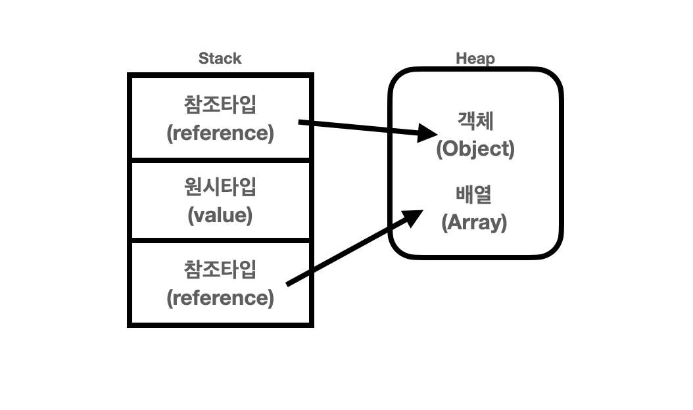

## 들어가며

프리코스를 진행하며 final을 지향하라는 지향하라는 말을 들었다. final을 사용하게 되면 초기화를 한번 밖에 해줄 수 밖에 없는 불변 상태가 되는데 값이 변하는 상황이 많은 프로그래밍 상황에 왜 사용해야하는지 의문이 들었다. 그래서 final에 대한 정확한 개념 정립과 나아가 불변객체가 무엇이고 왜 써야하는지를 정리하고자 한다.

## final

final 단어는 `마지막의` 또는 `변경될 수 없는(불변)` 이란 뜻을 지니고 있다. 이런 뜻처럼 Java에서도 final은 불변을 나타낸다. 정확히 말하지면 대상을 재할당하는 것을 막아주는 역할을 한다. final은 거의 모든 대상에 사용될 수 있으며 대상은 아래와 같다.

> final의 대상 - 클래스, 메서드, 멤버변수, 지역변수
> 

```java
final class FinalExample {                  // 조상이 될 수 없는 클래스

	final int MAX_SIZE = 10;                // 값이 변경될 수 없는 멤버변수(상수)
	final int MIN_SIZE = 1;		

	final int addSize(final int x, final int y) { // 오버라이딩할 수 없는 메서드(변경불가)
			final int additional = x + y;  // 값이 변경될 수 없는 지역변수(x, y, additional)
			return additinal;
	}
}
```

## 불변객체

그렇다면 final이 붙은 클래스로 객체를 만들게되면 그것이 불변 객체일까? 그것은 아니다. 클래스와 메서드는 단지 상속과 오버라이딩을 할 수만 없다. 즉 내부 필드값들은 변경이 가능하다는 것이다.

위키백과에서 불변객체는 `생성 후 그 상태를 바꿀 수 없는 객체` 라고 말한다. 이를 설명하기에 앞서 클래스를 인스턴스화하는 내부를 살짝 알아야하는데 아래 그림과 같다.



객체는 참조타입으로 실질적인 데이터는 메모리에서 heap이란 영역에 존재하며 stack 영역에서 참조변수를 통해 주소값을 참조해 값을 가져온다. 불변객체는 이러한 heap 영역에 존재하는 데이터가 변하지 않는 상태여야 한다. 그렇다면 내부 필드값을 다 final로 처리해주면 불변객체로 만들 수 있을까? 그것은 원시타입과 참조타입에 따라 고려해야할 점이 다르다.

### 원시타입

원시 타입은 boolean, int, float 등과 같은 `실제 데이터 값을 저장하는 타입` 이다. 실제 데이터를 바로 저장하기때문에 앞에 final을 적어주게되면 상수가 된다. 이런 경우에는 `Setter` 메서드만 만들지 않는다면 불변성을 유지할 수 있고 불변객체의 조건을 만족한다.

### 참조타입

참조타입은 문자열, 배열, 클래스등과 같은 heap영역에 실제 데이터 값을 저장하고 `참조변수로 데이터에 접근` 한다. 참조 타입도 final만 붙이면 불변이 되지 않을까? 예를 들어 생각해보자.

1. **생성자 인자로 외부 값을 가져와 초기화**
    
    ```java
    public class Cars {
        private final List<Car> cars;
        
        public Cars(List<Car> cars) {
            this.cars = cars;
        }
    }
    
    public class Car {
        private final String name;
        
        public Car(String name) {
            this.name = name;
        }
    }
    ```
    
    언뜻 보게되면 Cars 클래스의 필드에 final 붙고 Getter와 Setter가 없는 것을 불변객체라고 생각할 수 있다. 하지만 Cars 객체는 불변이 아니다. 외부에서 생성된 List 주소를 필드값에 주입하게 하면 외부에서 컨트롤이 가능하기 때문이다. 불변객체가 아닌 이유를 아래 코드를 보면 알 수 있다.
    
    ```java
    public static void main(String[] args) {
    	List<Car> carNames = new ArrayList<>();
        carNames.add(new Car("hodol"));
        Cars cars = new Cars(carNames);  // hodol만 들어간 리스트를 통해 생성
    
        for(Car car : cars.getCars()) {
            System.out.println(car.toString()); // 결과 : 호돌
        }
        System.out.println(cars);  // 주소 Cars@566776ad
    
        carNames.add(new Car("pobi")); //다른 값을 추가로 넣어줌.
        System.out.println(cars); // 주소 Cars@566776ad
    
        for(Car car : cars.getCars()) {
            System.out.println(car.toString()); //결과 : 호돌 포비
        }
    }
    ```

    외부에서 carNames라는 리스트의 주소값을 Cars 클래스 생성자를 통해 내부 필드값을 초기화 시켜줬다. 그 결과 외부에 있는 참조변수 carNames로
    Cars 객체 상태를 바꿀 수 있으며 이는 불변객체라 할 수 없다. 

    
2. **매번 새로운 객체를 생성**  

    그렇다면 객체가 같은 주소값을 공유하지 않게 할 수 없을까? 인자를 그대로 필드값으로 초기화 시키지말고 매번 새로운 객체를 생성하게 한다면 다른
    주소값을 가지며 접근할 수 없을 것이다.
    
    ```java
    public class Cars {
        private final List<Car> cars;
        
        public Cars(List<Car> cars) {
            this.cars = new ArrayList<>(cars);
        }
    }
    ```
    그러면 이제 완전한 불변객체를 만족하는 것인지 착각할 수도 있다. 일반적으로 Dto나 View를 사용하기 위해 getter를 많이 사용하는데
    이때 주의할 점이 있다.

    
3. **getter로 값에 접근한다면**  
    ```java
    public static void main(String[] args) {
        List<Car> carNames = new ArrayList<>();
        carNames.add(new Car("hodol"));
        Cars cars = new Cars(carNames);

        for(Car car : cars.getCars()) {
            System.out.println(car.getName());
        }

        cars.getCars().add(new Car("pobi"));

        for(Car car : cars.getCars()) {
            System.out.println(car.getName());
        }
    }

    // 실행 결과
    // hodol

    // hodol
    // pobi
    ```
    Cars 객체의 필드값을 getter로 접근해 값을 받게된다면 외부에서도 그 주소를 통해 접근할 수 있다. 
    이런 문제점은 아래 `Collections`가 제공하는 api를 활용해 예방할 수 있다.
    
    ```java
    public class Cars {
        private final List<Car> cars;

        public Cars(List<Car> cars) {
            this.cars = new ArrayList<>(cars);
        }

        public List<Car> getCars() {
            return Collections.unmodifiableList(cars);
        }
    }
    ```

    이렇게 최종적으로 Cars 객체는 접근이 불가능해 값을 변경할 수 없는 불변객체가 됐다.
    

### final과 불변 객체를 사용해야하는 이유

그렇다면 이 글의 목적인 final과 불변객체는 왜 사용해야하는지에 대해서 알아봐야한다. 다들 final이 좋다 불변적인 것이 좋다고 하는데 그 뜻을 생각해보면서 사용한
적은 별로 없었던 것 같다. 글을 작성하며 final과 불변 객체를 사용해야하는 이유에 대해서 아래와 같이 정리를 해봤다. 

-  **서비스의 안정성이 높음**  
한번 초기화되면 바꿀 수 없기에 버그 발생 가능성이나 찾는 시점이 빠라진다.
-  **스레드 동기화 문제 방지**  
매번 새로운 객체를 생성하기 때문에 동시성 문제에서 자유로울 수 있다.

### 정리  

이팩티브 자바에선 이런 구문이 존재한다.
> "불변 객체는 가변 객체보다 설계하고 구현하고 사용하기 쉬우며, 오류가 생길 여지도 적고 훨씬 안전하다."

이처럼 불변성은 코드를 더 깔끔하고 안전하게 만들어주는 것을 알 수 있다. 이런 불변성을 기반으로한 코드 작성은 앞으로 나뿐만 아니라 동료들과의
협업에서도 많은 도움이 될 것이다. 고로 final과 불변객체를 남용하는 습관을 가져보도록 하자!

### 참고

- 자바의 정석
- [https://tecoble.techcourse.co.kr/post/2020-05-18-immutable-object/](https://tecoble.techcourse.co.kr/post/2020-05-18-immutable-object/)
    - 코드 및 예시 인용
- [https://www.youtube.com/watch?v=ej-bnXlHk-E&ab_channel=우아한Tech](https://www.youtube.com/watch?v=ej-bnXlHk-E&ab_channel=%EC%9A%B0%EC%95%84%ED%95%9CTech)