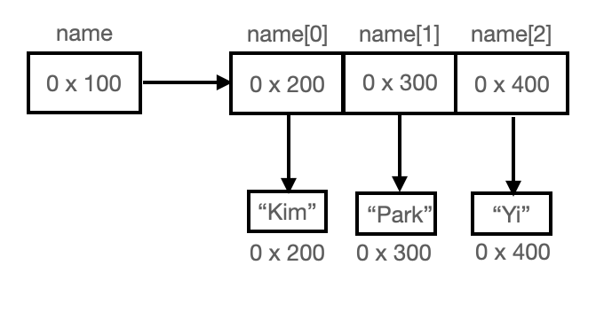

### 배열의 생성

배열은 선언한 다음 생성해야합니다.

- 선언: 단지 생성된 배열을 다루기 위한 참조변수를 위한 공간
- 생성: 값을 저장할 수 있는 공간

```java
int[] score;        //타입[] 변수이름; 배열 선언
score = new int[5]; //변수이름 = new 타입[길이];

int[] score = new int[5]; // 선언과 생성을 동시에 해주자
```

### 배열의 복사

배열은 한번 생성하면 길이를 변경할 수 없습니다. 배열을 복사하는 데에는 두가지 방법이 있습니다.

1. **for문을 이용한 복사 방법**

    ```java
    int[] arr = new int[5];
    ...
    int[] tmp = new int[arr.length*2];
    for (int i = 0; i < arr.length*2; i++){
        tmp[i] = arr[i];
    }
    arr = tmp;
    ```

참조변수 arr과 tmp는 같은 배열을 가리키게 됩니다. 하지만 전에 arr이 가리키던 배열은 더이상 사용이 불가능합니다.

2. **System.arraycopy() 방법**

    위의 for문 방법보다 훨씬 효율적인 방법입니다. 

    ```java
    System.arraycopy(num, 0, newNum, 0, num.length);
    // num[0]에서 newNum[0]으로 num.length개의 데이터만
    ```

### 배열 활용

#### 임의의 값으로 배열 채우기

```java
import java.util.*; //Arrays.toString을 쓰기 위해 추가

public class test {
    public static void main(String[] args){
        int[] code = {-1, 2, 3, 6};
        int[] nums = new int[10];

        for (int i = 0; i < nums.length; i++){
            int tmp = (int)(Math.random() * code.length);
            nums[i] = code[tmp];
        }
        System.out.println(Arrays.toString(nums));
    }
}
```

- Arrays.toString은 배열을 문자열로 출력해줍니다.
- Math.random()은 임의의 숫자를 배정해줍니다. 범위는 뒤에 `*숫자` 로 정해주면 되고 기본이 double형이기 때문에 int로 변환시켜줘야합니다.

#### 빈도수 구하기

```java
public class test {
    public static void main(String[] args){
        int[] arr = new int[10];
        int[] count = new int[10];

        for (int i = 0; i < arr.length; i++){
            arr[i] = (int)(Math.random()*arr.length);
            System.out.print(arr[i]);
        }
        System.out.println();

        for (int i = 0; i < arr.length; i++){
            count[arr[i]]++;
        }
        for (int i = 0; i < arr.length; i++){
            System.out.println(i + "의 개수 :"+count[i]);
        }
    }
}
```

- 같은 크기의 count 배열을 생성해 해당 인덱스를 계속 더해주는 방법으로 빈도수를 구해줄 수 있습니다.
- ~~파이썬에 절여진 나 반성해...~~

### String 배열

string 타입의 배열도 위의 int형 배열처럼 선언과 생성은 동일합니다. 하지만 다름 점은 기본값이 `null`로 배열의 각 요소는 String 값이 들어가는게 아니라 String 객체의 인덱스를 참조하는 형식입니다. 



#### char 배열과 String 클래스

사실 char 배열과 String과 같은 뜻입니다. 하지만 자바에서는 char 배열이 아닌 String 클래스를 이용해 처리하는 이유는 String 클래스가 char 배열에 여러가지 기능, 즉 함수(메서드)를 추가하여 확장한 것이기 때문입니다. 그래서 String 클래스를 사용하는 것이 문자열 다루기엔 더 쉽습니다.

> String 클래스는 char 배열에 기능(메서드)를 추가한 것이다.
> 

```java
String str = "Java";
str = str + "8";         //"Java8"이라는 새로운 문자열이 str에 저장된다.
System.out.println(str); //"Java8"
```

위의 예시는 문자열 str이 바뀌는 것 같지만 사실은 문자열은 변경할 수 없기에 새로운 내용의 문자열을 생성한 것입니다.

### 참고

- 자바의 정석