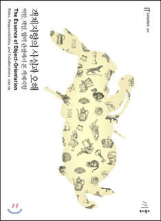
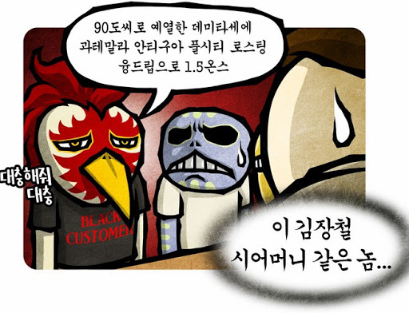
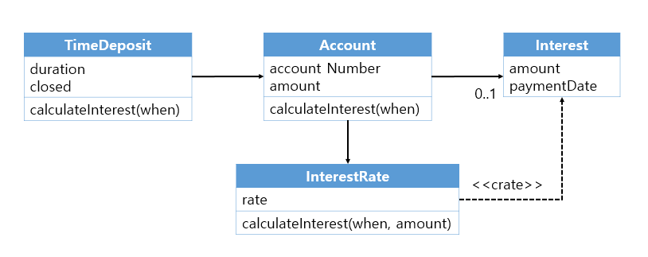

### 들어가며

주변의 추천으로 개발에 관련된 책을 처음 읽었다. 워낙 유명한 책이기도 했고 객체지향의 사실과 오해라는 제목 자체가 어떤 의민지도 궁금해 읽어보자 결심했다. 책 자체는 생각보다 두껍지 않은 약 250페이지(부록 포함)이지만 한장한장 넘길때마다 혼자 생각을 정리하거나 다시 읽는 부분이 많아 완독하는데 오래걸렸다. 이 책 역시 내가 제일 와닿았고 느낀점을 적으려한다.

### 그래서 객체지향을 제대로 알고 있었나??

먼저 책을 읽기 전에 이런 생각을 했다. 나는 객체지향은 무엇을 뜻하는지 제대로 알고 있나? 당시는 정확하고 자세하게는 아니지만 알고 있다고 생각했다. 클래스로 객체를 생성해 객체들끼리 혹은 클래스끼리 서로 정보를 주고 받는 것이 객체지향이다라고 말이다. 현실세계의 객체들을 그대로 소프트웨어 세계로 들고와 사용하고 있는 속성, 행위을 인스턴스 변수 및 메서드로 투영시켜 서비스를 만들었다. 하지만 이는 객체지향의 오해였다.

#### 첫번째 오해: 현실세계의 객체와 소프트웨어 세계의 객체는 다르다.

제일 잘못 오해하고 있던 것은 `소프트웨어 세계의 객체는 현실세계의 객체를 그대로 들고온 것이다` 라는 점이다. 여태 프로젝트나 공부를 할때 현실세계에 있는 객체들의 개념을 그대로 들고와 클래스를 만들고 구현을 해왔다. 또한 여러 객체지향에 대해 설명해주는 책들을 보아도 클래스와 객체를 현실에 비유해 이해 시켜줘 더욱 현실세계의 객체는 소프트웨어 세계의 객체라고 오해했다. 이렇게 생각하면서 어느 다른 객체에 심하게 의존하는 객체가 나타나기도 했다.

이런 오해를 바로 잡을 사실은 `객체는 살아있다` 라는 것이다. 현실세계에서는 혼자 스스로 무언가를 결정하지 못하는 객체들이 있다. 가령 물병은 스스로 물을 채우고 비울 수 없다. 하지만 소프트웨어 세계는 모든 객체들이 살아서 스스로 자신의 일을 할 수 있다. 물병이란 객체는 누군가에게 메시지를 받으면 스스로 물병의 물을 채우거나 비울 수 있어야 한다. 

#### 두번째 오해: 클래스는 객체지향의 핵심이 아니다.

클래스로 객체를 만든다. 흔히 말하는 인스턴스화로 인해 클래스를 객체지향의 그 자체라 생각했다. 클래스를 잘 작성해야 객체지향적으로 잘 작성하고 있구나 하고 말이다. 물론 틀린말은 아니지만 집중해야할 부분은 클래스 자체가 아닌 객체들 간의 협력, 메시지이다.

클래스는 객체를 추상화하기 위한 도구 중 하나일 뿐이다. 사람들, 개발자들은 시시각각 동적으로 바뀌는 객체에 대해서 인식하기엔 인지적 한계가 있다. 사람 A가 있다고 하자. 키가 작았던 어린 시절이나 키가 큰 현재, 그리고 살이 쪄서 통통 해질 수도 있다. 이렇게 달라지지만 A라는 사람이라는 사실은 바뀌지 않는다. 다양한 객체의 타입을 정적으로 규정하고 추상화해주는 도구가 클래스다.

 객체 지향에서 중요한 것은 정적인 클래스가 아니라 협력에 참여하는 객체이다. 예를 들어 ‘바리스타’의 인스턴스를 모델링한다고 하면 데이터나 클래스를 기반으로 설계하면 앞치마를 쓰고 단정하고 친절한 바리스타의 모습을 떠올리며 구현할 것이다. 하지만 이는 중요한 부분이 아니다. 바리스타는 ‘바리스타’라는 역할로 커피 주문을 받고 커피를 만드는 책임을 수행해야하기 때문이다. 협력에 대한 자세한 내용은 아래에서 정리하고 여기서 바로 잡을 오해는 `클래스는 객체지향의 핵심이 아니다`. 또한 `객체를 독립적인 섬으로 보지말고 협력하는 살아있는 객체로 보자는 것`이다.

### 객체지향적으로 생각해보기

가장 많이 한 오해, 실은 내가 정말 많이 느꼈던 객체지향의 오해들을 정리해봤다. 그렇다면 올바른 객체지향은 어떻게 생각하고 설계해야하는지에 대한 의문이 생겼다. 대표적인 설계기법으로는 `책임-주도 설계`, `디자인 패턴`, `테스트-주도 개발`이 있지만 좀 더 근본적인 생각을 정리하고 싶어서 따로 정리했다.

#### 객체 간의 협력, 메시지에 집중하자

이미 위에서 살짝 언급하면서 정리를 했지만 더 자세히 협력에 대해서 정리하고 싶었다. 객체지향은 살아있는 객체들의 협력을 통해 완성이 된다. 모든 객체들은 스스로 자신의 일을 할 수 있고 필요한 것이 있다면 알맞은 객체를 찾아 메시지를 보내 협력하게 된다. 

따라서 적절한 메시지를 보내야 적절한 책임과 역할이 부여된다. 그렇다면 적절한 메시지라는 것은 무엇을 뜻할까? 메시지를 보내는 객체가 송신자, 받는 객체가 수신자라고 한다면 수신자에게 자유롭게 의사결정을 할 수 있는 메시지를 의미한다. 객체는 스스로 결정하는 살아있는 객체이기 때문이다. 예를 들어 손님이 바리스타에게 아래와 같이 주문했다 하자.



그렇다면 바리스타는 어떤 원두를 쓸지, 어떤 방식으로 커피를 내릴지가 제한 받게 되므로 자유로운 행동을 할 수 없고 손님이란 객체에 의존이 될 수 밖에 없다. 여기서 적절한 메시지는 “아메리카노 한잔 주세요” 같은 추상적인 메시지이다. 그렇다면 바리스타는 자신만의 방식으로 스스로 만들어 결과만 손님에게 넘길 수 있고 의존성은 약해진다.

### 도메인 모델링과 유스케이스, 그리고 책임-주도 설계

객체 간의 메시지, 협력에 집중하며 객체지향적으로 코딩을 하면 된다는 것을 깨달았다. 하지만 협력을 어떤 방식으로 안정적이고 유연하게 설계해야 하는지는 막연했다. 객체지향을 위해서는 안정된 구조를 기반으로 필요한 기능들을 구현해 나가야하는데 이때 구조는 `도메인 모델링`, 기능은 `유스케이스` 를 바탕으로 `책임-주도 설계`를 하면 보다 명확하게 설계할 수 있다.

#### 도메인 모델링


안정적인 구조를 짜고 싶다면 도메인 모델링만한 것이 없다. 도메인이란 사용자가 프로그램을 사용하는 분야를 말한다. 모델링은 지식을 선택적으로 단순화하고 의식적으로 구조화하는 것을 의미한다. 따라서 도메인 모델링은 사용자가 프로그램을 사용하는 대상 영역에 관한 지식을 선택적으로 단순화하고 의식적으로 구조화하는 것이다.

왜 도메인 모델링이 안정적인 구조일까? 이는 본질적인 개념이 잘 바뀌지 않기 때문이다. 예를들어 은행 이자에 대해 생각해보자. 일정 만료기간이 되어야 이자를 지급해주는 은행의 구조는 본질적인 개념이다. 은행이란 도메인이 변화하지 않는이상 이런 구조는 바뀌지 않을 것이다. 설령 바뀐다해도 은행을 기반으로 구조를 유연하게 바꿀 수 있어 안정적이다.

#### 유스 케이스

사용자의 목표를 달성하기 위해 사용자와 시스템 간에 이뤄지는 상호작용의 흐름을 텍스트로 정리한 것을 `유스케이스`라고 한다. 결국 개발자가 직접적으로 구현해야하는 것은 기능적인 부분들이다. 유스케이스는 사용자들의 목표를 중심으로 시스템의 기능적인 요구사항들을 이야기 형식으로 묶을 수 있다. 이는 각 기능이 유기적인 관계를 지닌 체계를 이룰 수 있게 한다. 또한, 요구사항을 기억하고 관리하는데 도움을 준다. 다시 한번 은행 이자를 예시로 유스케이스를 작성한다면 아래와 같다.

```
유스케이스명: 중도 해지 이자액을 계산한다.

일차 액터: 예금주

주요 성능 시나리오
	1. 예금주가 정기예금 계좌를 선택한다.
	2. 시스템은 정기예금 계좌 정보를 보여준다.
	3. 예금주가 금일 기준으로 예금을 해지할 경우 지급받을 수 있는 이자 계산을 요청한다.
	4. 시스템은 중도 해지 시 지급받을 수 있는 이자를 계산한 후 결과를 사용자에게 제공한다.

확장
	a. 사용자는 해지일자를 다른 일자로 입력할 수 있다.
```

하지만 유스케이스만으로 객체지향적인 코드를 작성하긴 힘들다. 사용자 요구사항이란 변동성이 너무 크기 때문에 불안정하기 때문이다. 따라서 안정적인 도메인 모델링을 기반으로 기능적인 부분을 구현하는 것이 좋다.

#### 책임-주도 설계

도메인 모델은 안정적인 구조를 개념화하기 위해, 유스케이스는 불안정한 기능을 서술하기 위해 가장 일반적으로 사용되는 도구다. 변경에 유연한 소프트웨어를 만들기 위해서는 유스케이스에 정리된 시스템의 기능을 도메인 모델을 기반으로 한 객체들의 책임으로 분배해야 한다.

시스템은 사용자와 메시지를 주고 받는 커다란 객체라고 볼 수 있다. 이때 책임-주도 설계는 유스케이스로부터 첫 번째 메시지와 사용자가 달성하려는 목표를, 도메인 모델로부터 기능을 수용할 수 있는 안정적인 구조를 제공받아 객체들의 협력 공동체를 창조한다.

### 정리

책 제목 그대로 “객체지향의 사실과 오해”에 대해 깨달은 시간이었다. 항상 프로젝트를 만들때 클래스 위주로 작성하며 객체들간의 요청과 응답에 대해 고민했었다. 정말 객체, 아니 클래스라는 틀에 갇혀 설계하고 작성해서 프로젝트를 진행하던 도중에도 막연했다. 객체지향의 사실과 오해는 이런 나를 한단계 더 성장하게 해주고 두번 세번 생각을 할 수 있게 해준 책이다. 

### 참고 및 출처

- 조영호, 객체지향의 사실과 오해(위키북스, 2015)
- 이미지
    - 선천적 얼간이
    - 객체지향의 사실과 오해 6장