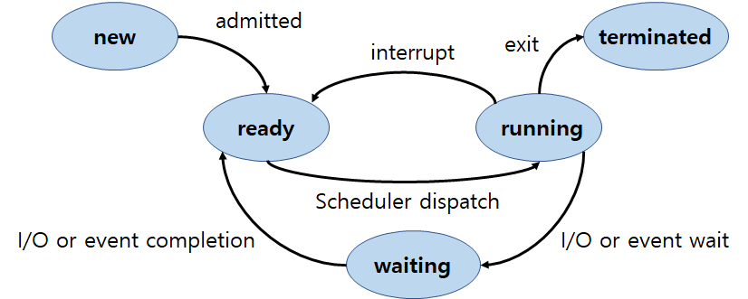

### 프로세스(Process)

프로세스는 실행 중인 프로그램을 말한다. 각각의 프로세스는 독립적으로 실행되며, 다른 프로세스의 영향을 받지 않는다. 각 프로세스는 운영체제로부터 자신만의 주소 공간, 메모리, 파일 등을 할당받는다.

#### 프로세스 상태(Process State)

- new: 프로세스 생성
- running: 명령어들이 실행
- waiting: 프로세스가 어떤 이벤트(예를들어 입출력)가 일어나기 기다림
- ready: 프로세스가 CPU에 할당되기전 대기
- terminated: 프로세스의 실행이 종료

#### 프로세스 제어 블록(PCB)

프로세스 제어 블록(Process Control Block, PCB)은 운영체제가 각각의 프로세스를 관리하기 위해 정보를 저장하는 자료구조다. PCB는 프로세스의 상태, 프로세스가 사용하는 자원, 프로세스의 우선순위 등의 정보를 저장하고 있다. 이런 프로세스의 정보들을 이용해 문맥교환(Context switch)같은 작업을 수행한다.

#### 문맥교환(Context Switch)

문맥교환(Context Switch)은 운영체제가 여러 프로세스를 동시에 실행하도록 하는 매커니즘이다. 각 프로세스는 독립적으로 실행되기 때문에, CPU가 어떤 프로세스에게 할당될지 결정하는 작업이 필요하다. 이때, 현재 실행 중인 프로세스의 상태를 저장하고, 다음 실행될 프로세스의 상태를 불러와 실행하는 작업을 문맥교환(Context Switch)이라고 한다. 이때, 프로세스 제어 블록(Process Control Block, PCB)에 저장되어 있는 정보를 사용하여 상태를 저장하고 불러온다. 이 작업은 CPU의 시간을 많이 소모하는 작업이므로, 문맥교환이 빈번하게 일어나면 시스템 성능이 저하될 수 있다.

### 스레드(Thread)

스레드는 프로세스 내에서 실행되는 실행 흐름 단위다. 즉, 프로세스 내에서 동작하는 여러 개의 스레드가 존재하면, 각각의 스레드는 독립적으로 실행된다. 스레드는 프로세스 내에서 생성된 모든 스레드가 동일한 메모리 주소 공간을 공유하기 때문에, 프로세스 내에서 자원을 공유하여 효율적인 처리가 가능하다. 이러한 특징으로 인해, 스레드는 프로세스에 비해 경량화되어 있으며, 병렬 처리에 활용된다.

#### 사용자 스레드, 커널 스레드

사용자 스레드(User Thread)와 커널 스레드(Kernel Thread)는 스레드의 실행 방법에 따라 구분된다.

- **사용자 스레드**  
    사용자 수준에서 스레드를 관리하는 방식으로, 스레드 라이브러리에서 관리된다. 운영체제는 사용자 스레드를 인식하지 못하고, 스케줄링 대상이 아니므로, 스레드 생성 및 관리에 대한 비용이 적다. 하지만, 스레드 블로킹(blocking)이 발생하면, 해당 프로세스 내의 모든 스레드가 블로킹 상태가 되어, 전체적인 성능이 저하될 수 있다.  
- **커널 스레드**  
    운영체제 수준에서 스레드를 관리하는 방식으로, 커널에서 직접 스케줄링 대상으로 인식된다. 따라서, 스레드 생성 및 관리에 대한 비용이 높고, 스레드 블로킹이 발생하더라도, 다른 스레드는 정상적으로 실행될 수 있다.

### 프로세스와 스레드의 차이점

- 프로세스는 독립적으로 실행되는 반면, 스레드는 프로세스 내에서 실행된다.
- 각각의 프로세스는 자신만의 주소 공간, 메모리, 파일 등을 가지고 있지만, 스레드는 프로세스 내에서 자원을 공유한다.
- 스레드는 프로세스 내에서 생성된 모든 스레드가 동일한 메모리 주소 공간을 공유한다.

### 참고

- 운영체제 Operating System Concepts 10판(퍼스트북, 2020)