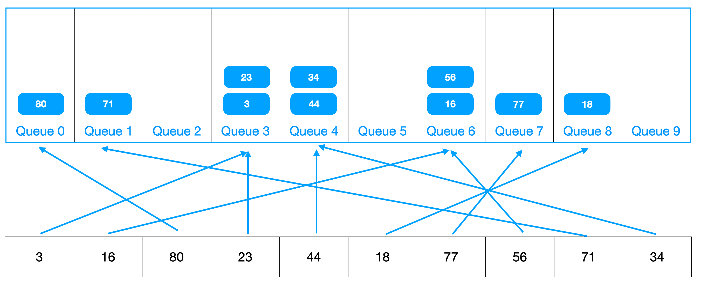

### 들어가며

알고리즘에서 정렬을 공부하다 기수 정렬을 접하게 됐다. 다른 비교 정렬 알고리즘으로는 시간복잡도가 안되는 것을 알았고 이론을 공부하는데 그냥 봐서는 이해가 잘 안되어 따로 글을 정리하며 이해해볼까 한다.

### 기수 정렬이란?

기수 정렬은 숫자를 정렬하는 알고리즘으로, 정렬되지 않은 각 숫자를 정렬하기 위해 사용된다. 이는 각 숫자의 자릿수별로 정렬하기 때문에 기수 정렬(radix-sort)이라고 불린다. 또한 버킷 정렬(bucket-sort)이라고 불리는 다른 기수 정렬 방법도 있다.



기수 정렬은 각 숫자의 자릿수별로 정렬하는 방식이며 배열 안의 숫자를 배열의 최하위 자릿수부터 정렬하는 과정을 반복하는 것이다. 자릿수가 높은 숫자부터 낮은 숫자로 정렬하는 과정은 이 정렬 알고리즘이 작동하는 방식이며, 이는 각 자릿수별로 배열을 분류하는 버킷 정렬과 비슷하다. 버킷 정렬은 각 자릿수별로 배열을 분류하여 각 버킷에 속하는 숫자를 정렬하는 방식으로 구현한다.

0-9까지 자릿수들을 담을 큐를 10개 생성한다음 1의 자릿수부터 정렬을 시작한다. 큐는 FIFO의 성질을 가지기 때문에 80, 71, 3, 23, 34, 16, 56, 77, 18 순서로 pop이 된다. 이어서 10의 자릿수를 기준으로 정렬하게 되면 정렬이 완료됨을 확인할 수 있다.

## 기수 정렬의 특징과 사용하는 이유

값을 비교하지 않아 비교 정렬보다 빠르다. 선택 정렬, 합병 정렬 등은 두 개의 값을 비교해 정렬하는 방식을 택하고 있다. 하지만 기수 정렬은 매번 각 자릿수(십진수는 10개)로 정렬하기 때문에 입력값의 크기에 영향을 받지 않는다. 시간 복잡도를 계산한다면 **O(kn)**이 된다.

- 시간 복잡도 **O(kn)**
- 장점
    - 문자열, 정수 정렬에 용이
- 단점
    - 자릿수가 없는 것은 활용할 수 없다. (예시: 부동 소숫점)
    - bucket이라는 배열을 사용해 메모리가 더 소모됨

### 기수 정렬 코드

```java
public static void radixSort(int[] arr) {
    int maxDigit = getMaxDigit(arr);

    for(int k = 0; k < maxDigit; k++) {
        List<List<Integer>> buckets = new ArrayList<>();
        for(int i = 0; i < 10; i++) {
            buckets.add(new ArrayList<>());
        }

        for(int i = 0; i < arr.length; i++) {
            int digit = getDigit(arr[i], k);
            buckets.get(digit).add(arr[i]);
        }

        int j = 0;
        for(int i = 0; i < 10; i++) {
            for(int value : buckets.get(i)) {
                arr[j++] = value;
            }
        }
    }
}

public static int getMaxDigit(int[] arr) {
    int max = Integer.MIN_VALUE;
    for(int i = 0; i < arr.length; i++) {
        max = Math.max(max, arr[i]);
    }

    int digit = 0;
    while(max != 0) {
        max /= 10;
        digit++;
    }

    return digit;
}

public static int getDigit(int n, int k) {
    for(int i = 0; i < k; i++) {
        n /= 10;
    }
    return n % 10;
}
```

### 정리

기수정렬의 내부 코드를 공부해도 잘 이해가 안되었는데 알고보니 계수정렬을 바탕으로 더 확장된 알고리즘이였다. 항상 정렬에서 시간복잡도가 O(nlogn)만이 최선일 것이라 생각했다. 하지만 다른 정렬들도 많았는걸 알 수 있었다. 비록 범위가 한정적이긴 하지만 입력값이 많다면 기수정렬을 떠올려야겠다.

### 참고

- [gyoogole님의 테크인터뷰 - 기수 정렬](https://gyoogle.dev/blog/algorithm/Radix%20Sort.html)
- 위키 백과 - 기수 정렬
- 김종관, Do it 알고리즘 코딩테스트 자바편(이지스 퍼블리싱, 2022)