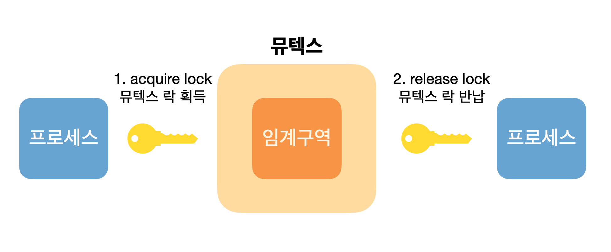

### 들어가며

CPU 등의 성능향상을 위해 거의 모든 프로세스와 스레드들이 병행,병렬 실행된다는 것을 알고 있다. 하지만 공유된 데이터를 동시에 접근하면 데이터의 일관성이 지켜지지 않을 수 있다. 이처럼 동시에 여러 개의 프로세스가 동일한 자료를 접근하여 조작하고, 그 실행 결과가 접근이 발생한 특정 순서에 의존하는 상황을 `경쟁 상황(race condition)` 이라고 한다. 이런 동기화 문제들을 해결하는 도구들과 관련된 개념들을 정리해보고자 한다.

### 임계구역 Critical Section

프로세스나 스레드가 공유 자원을 사용하는 경우, 동시에 해당 자원에 접근하면 문제가 발생할 수 있다. 이때, 문제가 발생할 가능성이 있는 코드 영역을 `임계구역(Critical section)`이라고 한다. 

임계구역 문제를 해결하기 위해서는 다음 세 가지 요구조건이 충족되어야 한다.

1. **상호 배제(Mutual exclusion)**: 한 프로세스가 임계구역을 사용 중일 때, 다른 프로세스는 그 구역에 접근할 수 없어야 한다.
2. **진행(Progress)**: 임계구역에 없는 프로세스가 임계구역에 들어가길 기다리고 있는 프로세스들 중 하나는 언젠가는 들어갈 수 있어야 한다.
3. **한정된 대기(Bounded waiting)**: 임계구역에 들어가기 위해 대기하는 프로세스들은 유한 시간 안에 들어갈 수 있어야 한다.

### Peterson의 해결안 (고전적인 소프트웨어적 해결방법)

Peterson의 해결안은 두 개의 프로세스가 공유 자원을 사용하는 경우, 서로 자원 사용 여부를 확인하고 일정 시간 동안 대기하도록 하는 방법입니다. 이를 위해 Peterson은 두 개의 변수 `turn`과 `flag`를 사용합니다.

```c
while (true) {
  flag[i] = true;
  turn = j;
  while (flag[j] && turn == j);
  // critical section
  flag[i] = false;
  // remainder section
}

```

### Perterson의 문제점

그러나 Peterson의 해결안에는 상호 배제가 보장되지 않는 경우가 있다. 예를 들어, 두 개의 프로세스가 동시에 flag[i]와 flag[j]를 true로 설정하면, 두 프로세스 모두 임계 구역에 접근할 수 있게 된다. 

```nasm
register = count
register = register + 1
count = register
```

위 같이 count++ 라는 한 줄을 예로 들자면 3줄의 기계어로 나뉠 수 있다. 프로그래밍 언어적으로는 한 줄의 코드로 보이지만 기계어로는 여러줄의 코드로 구현되어 있다는 사실이다. 그렇다면 기계어를 수행하는 가운데 문맥 교환이 일어나게 되면 동기화 문제가 발생할 수 밖에 없다. 즉 원자성(atomic)이 안지켜진다는 것이다.

### 하드웨어적인 동기화 해결법

동기화를 위한 하드웨어 지원은 몇 가지가 있다.

- **TestAndSet()** 명령어: 하드웨어적으로 상호 배제를 지원하는 명령어다. 이 명령어는 변수를 하나 받아와서 그 변수의 값을 반환하면서 동시에 그 변수의 값을 true나 false로 바꿔준다. 따라서 이 명령어를 사용하면 변수의 값을 안전하게 바꿀 수 있다.
- **Swap()** 명령어: TestAndSet()과 비슷한 명령어로, 변수 두 개를 받아와서 두 변수의 값을 서로 바꿔준다. 이 명령어를 사용하면 두 변수의 값을 안전하게 바꿀 수 있다.
- **인터럽트 비활성화**: 인터럽트를 비활성화하면 현재 실행 중인 프로세스가 종료될 때까지 다른 프로세스가 실행되지 않는다. 이를 이용하여 상호 배제를 구현할 수 있다.

하지만 응용 프로그래머가 하드웨어적인 동기화 해결법으로 해결하기엔 복잡하기에 사용할 수가 없다.

### 동기화 문제를 해결해줄 도구들

동기화 문제를 해결하기 위해선 임계 구역 문제를 해결해야한다. 물론 상호배제, 진행, 한정된 대기 3가지 모두 해결하면 완벽한 도구이지만 현실적으로 불가능에 가깝다. 그래서 가장 해결하기 쉬운 상호 배제 문제를 해결하는 방식들이 나왔고 뮤텍스(mutex), 세마포어(semaphores), 모니터(monitors)가 그 방식들이다.

### Mutex locks



가장 간단한 도구가 뮤텍스 락이다. 뮤텍스 락은 임계구역을 보호하기 위해 임계구역에 들어가기 전 반드시 락을 얻어야하고 임계구역을 빠져 나올 때 락을 반환해야한다. acqurie() 함수가 락을 획득하고 release() 함수가 락을 반환한다. 

뮤텍스 락은 available이라는 boolean 변수를 가지는데 해당 변수를 통해 락의 가용여부를 표시한다. 락이 가용하면 acquire() 호출을 한다음 바로 사용불가 상태로 바꿔준다. 

```java
acquire() {
	while (!available)
		; // busy wait
	available = false;
}
```

```java
while (true) {
	// acquire lock
		critical section
	// release lock
		remainder section
}
```

### Mutex locks의 문제점

한 프로세스가 임계구역에 있는 동안 다른 프로세스들은 임계구역에 들어가기 위해 acquire() 함수를 계속 호출해야하는 현상을 `바쁜 대기(busy waiting)`이라고 한다. 이러한 루프는 하나의 CPU 코어가 여러 프로세스에게 공유되는 실제 다중 프로그래밍 시스템에서 문제가 된다. 바쁜 대기는 다른 프로세스가 사용할 수 있는 CPU 주기를 낭비시킨다.

### Mutex locks == Spinlock

뮤텍스 락을 `스핀락(spinlock)`이라고도 부른다. 락을 사용할 수 있을때까지 프로세스가 회전을 하기 때문이다. 스핀락이라고 따로 명칭한 이유는 바쁜 대기의 장점도 존재하기 때문이다. 다중 코어에서는 한 프로세스가 락을 획득하고 있는 가운데 다른 프로세스나 스레드는 다른 CPU에서 바쁜 대기를 하고 있을 수 있다.

만일 하나의 CPU 코어만 있다면 다른 프로세스들은 대기 큐로 들어갔다가 락이 반환됐을 때 다시 준비 큐로 돌아가서 cpu를 점유해야한다. 이렇게 되면 `CPU → 대기 큐`로, `대기큐 → 준비큐`로 총 2번의 문맥교환이 일어나기 때문에 상당한 시간이 소요될 수 있는데 바쁜 대기는 이런 문제를 해결해줄 수 있다. 최신 다중 코어 컴퓨팅 시스템에서 스핀락은 많은 운영체제에서 쓰이고 있다.

### Semaphores

뮤텍스 락에서 더 정교해진 기법이 세마포어이다. 세마포어 S는 뮤텍스의 avaliable 변수와 달리 정수 변수다. 초기화를 제외하고는 wait()와 signal() 로만 접근이 가능하다.

```java
wait(S) {
	while (S <= 0)
		; // busy wait
	S--;
}

signal(S) {
	S++;
}
```

세마포어는 `유한한 개수를 가진 자원에 대한 접근을 제어`하는 데 사용된다. 가용한 자원의 개수로 S를 초기화하며 각 자원을 사용하려는 프로세스는 세마포어에 wait() 연산으로 감소 시키고, 자원을 방출하면 signal() 연산으로 증가 시킨다.

여기서 가용한 자원이 하나라고 하면 `이진 세마포어`로 부르며 이는 뮤텍스 락과 유사하게 동작한다. 이외의 많은 자원들을 가지는 세마포어를 `카운팅 세마포어`라고 부른다.

### Semaphores의 단점

뮤텍스에서 다중처리에 용이하게 구현된 것이 세마포어이기에 뮤텍스의 `바쁜대기` 단점을 공유한다. 프로세스가 wait() 연산을 실행하고 세마포어 값이 양수가 아님을 확인하면 계속 대기해야한다.(wait() 안의 while 문) 

그러나 바쁜 대기 대신 프로세스는 자신을 일시 중지 시킬 수 있다. 일시 중지 연산은 프로세스를 세마포어에 연관된 대기 큐에 넣고, 프로세스의 상태를 대기 상태로 전환한다. 그렇다면 제어가 CPU 스케쥴러에게 넘어가고, 바쁜 대기로써 생기는 시간 낭비 문제가 해결된다.

또한 `교착상태 (Deadlock)` 문제가 생길 수 있다. 세마포어가 준비큐를 가지고 있고, 둘 이상의 프로세스가 임계 구역 진입을 무한정 기다리고 있으면, 임계구역에서 실행되는 프로세스는 기다리고 있는 프로세스가 실행되어야만 빠져나올 수 있는 상황이 발생할 수 있기 때문이다.

### Monitors

고급언어에서 사용되는 동기화 문제 해결 도구다. 결국 뮤텍스와 세마포어는 직접 lock을 얻고 반납하는 것을 설정해줘야하는데 모니터는 이러한 문제를 자동으로 처리해준다.(추상화된 데이터)

### 참고

- 운영체제 Operating System Concepts 10판(퍼스트북, 2020)