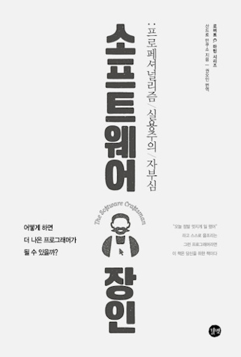

### 들어가며

아직 개발자로서 커리어를 시작하지 않았지만 어떤 개발자여야 할지는 계속 생각해봤다. 한정된 시간 안에서 보다 많은 양의 기능을 구현 할 수 있는 개발자? 아니면 보다 효율적인 시스템을 구축해 업무의 효율을 높이는 개발자가 되어야 맞는걸까? 이 책은 이러한 고민들을 이미 해본 저자가 자신의 경험을 바탕으로 좋은 개발자란 즉, 소프트웨어 장인이란 무엇인가를 잘 풀어서 얘기해준다. 이 책 역시도 지금 나에게 와 닿았던 내용들을 위주로 적어볼까 한다.

#### 좋은 시스템의 이전에 기술적인 역량은 기본이다.

많은 개발 방법론이 있지만 현시대는 역시 애자일의 중요성이 강조된다. 또한 이런 애자일을 실행하는 [XP(익스트림 프로그래밍)](https://en.wikipedia.org/wiki/Extreme_programming), [Lean(린 프로세스)](https://en.wikipedia.org/wiki/Lean_manufacturing)등이 있다. 저자 또한 이러한 프로세스들을 왜 써야하는지에 대한 얘기들을 해준다. 나 역시도 여러 자료들이나 블로그 글들을 보면서 별반 다를 것 없다고 느꼈다.

하지만 애자일 도입을 실패한 사례들도 말해주며 좋은 시스템 이전에 개발자가 가져야하는 근본적인 기술적 역량을 강조해줬다. 제 아무리 좋은 도구와 재료라도 요리사가 실력이 없으면 음식의 맛이 많이 좌우되기 때문이다. 아직 기술적 역량이 많이 부족한 나에게 와 닿는 내용이였으며 이후 어떻게 기술적 역량을 쌓아나갈 것인지 고민하게 해줬다.

### 끊임없는 자기계발

누군가 그랬다 개발자는 평생 공부해야한다고 말이다. 하지만 어떻게 공부해야한다고 말해주는 사람은 별로 없었다. (내가 느끼기엔) 이런 현상은 역시 각자마다 공부하고 자기계발하는 방식이 달라서 쉽사리 조언을 못해주는 것일 거다. 저자 또한 조심스럽게 자기계발을 위해 할 수 있는 것을 몇가지 추려줬는데 공감이 됐다.

#### 독서, 많은 독서

요즘 개발에 관련된 책들을 읽고 있어서 많이 공감됐다. 독서란 좋은 개발자의 생각을 엿볼 수 있는 기회라고 생각이 든다. 또한 보다 정확한 정보를 얻을 수 있는 곳이기도 하다. 특히 개인적으로 특정 기술을 배울 때 책을 통해 배우면 순서대로 차근차근 배울 수 있어 더 정리가 잘되기도 한다. 여기서 저자는 책의 목적에 따라 4가지로 분류했는데 추후 읽어보고 싶어 따로 정리했다.

- **특정 기술에 대한 서적**
    - Java, Node.js 등등  
- **특정 개념에 대한 서적**
    - TDD
    - 도메인 기반 개발
    - 객체 지향 설계
    - 함수형 프로그래밍
    - NoSQL
    - 데이터베이스 모델  
- **행동양식에 대한 서적**
    - 애자일 방법론
    - 소프트웨어 장인 정신
    - 린 소프트웨어 개발
    - 심리학, 철학, 경영 등등  
- **혁명적 서적(또는 고전)**
    - 실용주의 프로그래머
    - 디자인 패턴(GoF)
    - 테스트 주도 개발(켄트백)
    - 익스트림 프로그래밍
    - 클린코더
    - 리팩토링

단기적, 중기적으로는 특정 기술에 대한 책을 읽으면 좋고 커리어를 위해서라면 개념이나 행동양식 특히 혁명적 서적들을 추천해줬다. 

#### 블로그

블로그는 자기계발의 아주 좋은 수단이다. 저자 또한 블로그를 추천했다. 블로그는 실제 경험, 개인적인 발견, 의견, 성공담, 실패담들이 짧게 담겨있어 소프트웨어 장인정신이나 애자일 모델에 태생적으로 궁합이 잘맞기 때문이다. 하지만 늘 블로그를 시작할 때부터 어떤 글을 올려야할지 혹시나 글을 올리기엔 아직 역량이 부족하진 않은지에 대한 고민을 했었다. 

그러다 결국 내린 결론은 나 자신을 위한 기록을 우선으로 여기기로 했다. 이런 생각을 책을 통해 더 공고히 다져나갈 수 있었다. 오늘날 좋은 글을 쓰는 사람들도 결국 이러한 노력과 습관들이 모여서 된 것이라 생각된다. 

#### 다양한 소통

여러 커뮤니티나 대외적인 활동, 스터디등을 참여하고 다양한 사람들과 소통해야한다. 제 아무리 혼자서 공부하고 뿌듯함을 얻어도 우물 안의 개구리가 되기 십상이다. 소통하면서 내가 부족한 부분들을 깨우쳐가고 최신 정보 동향도 알아가는게 좋은 개발자의 밑거름이라 생각하게 된다.

또한 팔로우할 리더를 찾아야 한다. 특정 기술 분야에 대한 리더 뿐만 아니라 개념적, 행동양식적인 부분에 대한 리더들도 존재한다. 이러한 리더들이 누구인지 알면 유익한 정보나 관련 서적을 찾기가 수월해지기 때문이다. 당장 이 책을 읽음으로서 좋은 개발자가 무엇인지에 대한 생각을 할 수 있었고 읽고 싶은 서적들도 훨씬 넓어졌다.

#### 끊임없는 훈련

끊임없는 훈련을 통해 실행 관례와 새로운 기술들을 배워야 한다. 이때 훈련의 기준은 `어떻게` 해결할지가 중요하다. 소프트웨어 개발은 결과가 매우 중요하다. 하지만 훈련에서 만큼은 결과보다 과정을 어떻게 해결할 것인지, 어떤 방식으로 해결할 것인지 집중해야한다.

어떤 기술이든 더 많이 훈련할수록 더 편안해지고 자연스럽게 할 수 있게 된다. 그렇담 훈련하기 위해서 어떤 방법들이 있을까? 저자는 4가지를 추천해줬는데 페어 프로그래밍은 현실적으로 아직 힘들어 빼고 정리해봤다.

1. **카타**
    
    ‘품세’라는 뜻으로 일본 무예 훈련에서 나온 용어다. 여기서는 작은 훈련용 코딩들을 의미한다. 예를 들어 볼링 점수 계산 문제 같은 것이다. (생각해보니 우테코 프리코스에서 나온 문제들도 다 카타에 해당되는 것 같다.) 카타의 목적은 익숙하지 못한 새로운 테크닉이나 기술을 능숙도를 올리기 위함이다. 같은 코딩 카타를 반복하더라도 매번 다른 테크닉, 다른 언어, 다른 기술로 해야 효과를 최대화 할 수 있다. 
    
2. **펫 프로젝트(토이 프로젝트)**
    
    최고의 자가 학습, 자가 훈련방법이다. 먼저 무엇을 배울지, 즉 어떤 실행 관례, 실행 원칙, 방법론, 기술을 배울지 정하고 그 다음에 해결할 문제를 찾는다.
    
3. **오픈 소스**
    
    배우고 싶은 내용과 연관 있는 오픈소스를 찾아 실행해보고, 테스트 코드가 있다면 읽어본다. 디버깅 해보고 이용해본다. 기여할 부분이 보인다면 아주 작은 부분 부터 기여해보면서 시작하면 좋다.
    
    오픈소스의 좋은 점은 훌륭한 개발자들이 어떻게 일하는지 체험 해볼 수 있다는 것이다. 최근 java api 내부 소스 코드를 보면서 좋은 코드를 볼 수 있어 한층 성장하는 기분이 들어서 더 공감이 간다.
    

### 시간은 없지 않다.

하루에 의미없는 웹서핑을 하고 휴대폰, 유튜브 보는 시간이 얼마나 된다고 생각하나? 정말 그런 시간이 별로 없다면 시간이 없다고 말할 수 있겠지만 보통은 그러지 않을 것이다. 나 또한 이런 시간들이 모이고 모여 크다는 사실을 깨닫고 줄이려 노력 중이다! 그렇다고 없앨 수는 없겠지만 (나름의 휴식 차원에 필요하다) 이런 시간들을 다 보내고도 시간이 없다고는 말하지 말자.

또한 테스트 코드 작성 시간이 오래걸린다고 생각한다고 해서 시간이 없으니 프로젝트를 진행할 때 그냥 동작하는 프로그램이라도 만들자는 틀렸다. 테스트 코드를 작성하지 않으면 결국 에러가 나면 하나하나 디버깅을 해야한다. 또한 개발이 진행될 수록 전체적인 테스트를 진행하는 시간은 계속 늘어갈 것이 뻔하다. 과연 디버깅과 테스트할 시간은 있고 테스트 코드를 작성할 시간은 없는 것일까? 시간은 없지 않다.

### 어떤 커리어가 좋은 커리어인가

커리어에 정답이 있을까? 저자는 없다고 대답했다. 커리어를 몇 년짜리 프로젝트라 여기고 앞으로 어떻게 관리할 지 생각해보자. 중간에 많은 것이 바뀔 수도 있지만 가장 큰틀은 바뀌지 않을 것이다. 이를 작은 단위로 나누고 단계 마다 프로젝트의 목표를 재평가하고 필요한 경우 수정할 수 있다고 생각해야한다.

때로는 개인적인 삶에 의해서 커리어를 결정할 수도 있다. 돈이 더 필요하다면 임금을 높이 주는 곳을 선택하는 것이다. 커리어에서 옳고 그른 것은 없다. 단지 지식은 영원하고 돈과 안정은 영원할 수 없다는 것만 새기고 있자. 

### 회사를 선택하는 기준: 자율성, 통달, 목적의식

어떤 기준을 가지고 회사를 선택을 선택해야할까? 이 내용에 대해 저자가 명확하게 정리해줘 그대로 가져와봤다. 내용은 다음과 같다. 다니엘 핑크의 저서 “원동력: 동기부여에 대한 놀라운 진실” 에서 돈은 충족되어야하는 기본 조건이고, 지식 노동자를 움직이는 것은 자율성, 통달, 목적의식 이렇게 세가지라고 한다.

- 자율성: 우리가 무엇을, 어떻게, 언제할지 통제할 수 있는 상태
- 통달: 더 나은 인간이 되기 위해 계속 배우고 진화하는 것
- 목적의식: 지금 하고 있는 일이 중요하고 무언가를 더 나아지게 하고 있다고 느끼는 것

이런 조건들은 돈만을 쫒아 일할 곳을 선택하면 커리어가 중단되기 쉬워질 수도 있다는 것을 알려준다. 지금으로서 나는 통달을 포기할 수는 없을 것 같다. 하지만 이 세가지를 기억하고 앞으로의 일할 곳을 고려해봐야겠다.

### 정리

글에 미쳐 정리하지 못했지만 중간중간 와 닿는 글귀들이 많았다. 예를 들어 동작하는 소프트웨어를 빨리 만드는 것과 허술하게 만드는 것은 다르다고 한 부분이 있다. 모든 일이 그렇겠지만 빨리 한다는 것은 허술하게 빨리하라는 말이 아니다. `제대로` 빨리 하는 것이다. 개발자는 어느 경우에서라도 깨끗한 코드를 작성할 의무를 지녀야한다는 것이다. 

책을 읽고 나서 어떤 개발자로서 성장해나가야 하는지 알 수 있었다. 또한 지금까지 내가 생각하고 하고 있던 일들을 되돌아보면서 회고할 시간도 가질 수 있었다. 훗날 개발자로서의 마음가짐을 가지고 성장한 뒤 몇년이 지난 날에 다시 읽어보면 또 얻어가는게 많을 것 같은 책이다. 그때가 되면 다시 한번 읽어보고 지금 2023년의 나와 비교해보면 재밌을 듯 하다.

### 참고 및 출처

- 산드로 만쿠소, 소프트웨어 장인 : 프로페셔널리즘/ 실용주의/ 자부심 (길벗, 2015)