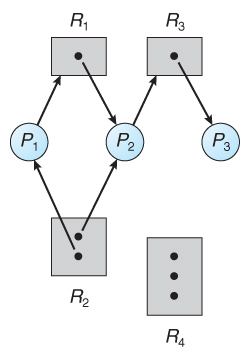
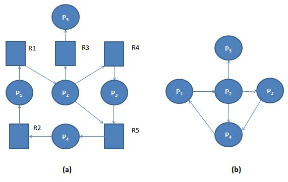

### 들어가며

특히 사거리 도로에서 꼬리물기를 하게되면 교차로에서 모든 차들의 진행방향이 막혀 교통마비가 되는 경우가 있다. 어느 차선에서도 다른 차선으로 가기 위해서는 가고자하는 차선이 비어있어야하는데 차선이 이미 차있어 가지 못하는 교착상태에 빠진다. 

다중 프로그래밍 환경에서도 비슷한 일이 일어날 수 있다. A 스레드가 자원을 요청했는데 그 자원을 다른 B 스레드가 점유하고 있고 마찬가지로 점유하고 있는 B 스레드가 자원을 요청했는데 A 스레드가 점유하고 있다면 이도 저도 못하는 상황을 교착상태, `데드락(DeadLock)`이라고 한다.

### 교착 상태 발생 조건

그렇다면 교착상태는 어떤 상황일 때 발생할까? 아래 4가지 필요조건을 모두 만족해야지 데드락이 발생하게 된다.

1. **상호 배제(mutual exclusion)**
2. **점유하며 대기(hold and wait)**
3. **비선점(no preemption)**
4. **순환 대기(circular wait)**

#### 자원 할당 그래프

그림과 같은 그래프를 `자원 할당 그래프`라고 한다. 교착 상태를 방향 그래프로 시각화하여 더 정확하게 기술할 수 있다. P는 프로세스를 뜻하고 R은 자원 유형을 뜻하며 R 안의 점은 자원의 개수를 뜻한다. 

자원 할당 그래프에서 사이클(cycle)의 유무를 명확하게 확인할 수 있다. 사이클 유무의 정보로 사이클이 없다면 교착 상태가 아니다. 라고 정의할 수 있고 사이클이 있다면 교착 상태를 의심해봐야한다.

### 교착 상태 처리 방법

- 문제를 무시하고, 교착 상태가 시스템에서 절대 발생하지 않게 한다.
- 시스템이 결코 교착 상태가 되지 않도록 보장하기 위하여 교착 상태를 예방하거나 회피하는 프로토콜을 사용
    - `교착 상태 예방 (prevention)` , `교착 상태 회피 (avoid)`
- 시스템이 교착 상태가 되도록 허용한 다음 교착 상태가 된다면 복구 시키는 방법

### 교착상태 예방 방법

교착상태를 예방하려면 네 가지 필요조건이 다 만족해야하는데 이 말인 즉 최소 하나가 성립하지 않도록 보장하면 교착상태를 예방할 수 있다는 말이 된다. 

#### 상호배제

사실상 불가능하다. 이미 동기화문제를 처리하면서 근본적으로 공유가 불가능한 자원도 있기 때문이다. 예를들어 Mutex 락은 동시에 여러 스레드가 공유할 수 없다.

#### 점유하며 대기

스레드가 자원을 요청할 때마다 다른 자원을 보유하지 않도록 보장해주면 된다. 이 문제를 해결하기 위해 2가지 프로토콜이 존재한다.

- 각 스레드가 실행을 시작하기 전에 모든 자원을 요청하고 할당
- 스레드가 자원을 전혀 갖고 있지 않을때만 자원을 요청

하지만 이 프로토콜은 두 가지 단점을 지니고 있다.

1. 자원이 할당 되었지만 장기간 사용하지 않을 수 있기 때문에 자원 이용률이 낮을 수 있다.
2. 기아가 발생할 수 있다.

#### 비선점

스레드가 선점 당할 수 있도록 해준다. 그렇다면 이런 프로토콜을 생각할 수 있다.

- 스레드가 반드시 대기해야한다면 현재 점유하고 있는 모든 자원이 선점된다.
    - 스레드는 자신이 요청하고 있는 새로운 자원은 물론 이미 점유했던 옛 자원들을 다시 얻어야만 시작할 수 있게된다.

비선점 방법은 CPU 레지스터나 데이터베이스 트랜잭션처럼 그 상태가 쉽게 저장되고 후에 복원될 수 잇는 자원에 종종 적용된다. 하지만 교착상태가 자주 발생하는 mutex 락과 세마포어 같은 자원에는 적용이 불가능하다.

#### 순환 대기

이전 세가지 필요조건들 보다 실용적인 해결책을 제공해준다. 

- 모든 자원 유형에 전체적인 순서를 부여하여, 각 프로세스가 열거된 순서대로 오름차순으로 자원을 요청하도록 요구

하지만 순환 대기를 해결해줘도 문제점이 발생한다.

- 다른 스레드가 계속 중간에 열거된 자원을 점유하고 있다면 기아가 발생할 확률이 높아진다.
- 락 순서로 인한 교착 상태가 발생할 수 있다.

### 교착 상태 회피

교착 상태 예방 방법은 장치의 이용률을 저하 시키거나 시스템 총 처리율(throughput)를 감소시킨다. 이렇게 된다면 멀티 스레드 환경을 사용하는 이유가 무색 해진다.

교착 상태 예방 방법 대안으로 교착 상태 회피가 제안됐다. 교착 상태를 회피하려면 어떤 방식을 사용해야할까? 각 스레드가 요청할 자원들의 `최대 수` 를 미리 파악해서 교착 상태에 빠지지 않도록 알고리즘을 작성하면된다.

교착 상태 회피 알고리즘은 시스템에 순환 대기 상황이 발생하지 않도록 자원할당 상태인 `가용 자원 수`, `할당된 자원의 수` 그리고 `스레드의 최대 요구 수`에 따라 작성된다. 회피 알고리즘에는 대표적으로 자원 할당 그래프 알고리즘과 뱅커스 알고리즘이 있다.

### 교착 상태 탐지

교착 상태를 방치하고 교착 상태가 일어나게 되면 다음 알고리즘들을 반드시 수행해야한다.

- 교착 상태가 발생했는지 탐지하는 알고리즘
- 교착 상태로부터 회복하는 알고리즘

#### 교착 상태 탐지 알고리즘

- **대기 그래프 Wait - for graph**
    
    각 자원이 하나의 인스턴스만 가지고 있을 때 사용하는 그래프이다. 자원 할당 그래프로부터 자원 유형 노드를 제거하고 적절한 간선들을 결합함으로써 얻을 수 있다.

    

    
- **각 자원의 인스턴스가 여러개 일때**
    
    뱅커스 알고리즘과 같이 available, allocation, request를 바탕으로 가능한 모든 할당 순서를 조사하는 방식이다.
    

#### 교착 상태 탐지 알고리즘 사용하는 시기

- 교착 상태가 얼마나 자주 발생하는가
- 교착 상태가 일어나면 통상 몇 개의 스레드가 원인이 되는가

교착 상태가 자주 일어난다면 탐지 알고리즘을 자주 돌려야한다. 반대로 너무 늦게 탐지 알고리즘을 돌리게 되면 교착 상태에 연관된 스레드가 늘어나기 때문에 적절히 돌려야한다.

### 교착 상태 회복 방법

탐지 알고리즘이 교착 상태가 존재한다고 하면, 여러 대안의 처리 방법이 있다. 운영자가 수작업으로 처리하거나 시스템이 자동으로 처리하게 된다. 교착 상태를 깨뜨리는 데는 한 개 이상의 스레드를 중지하거나 하나 이상의 스레들로부터 자원을 선점하는 두 가지 방법이 있다.

#### 프로세스와 스레드 종료

- **교착 상태 프로세스를 모두 중지**  
  
    확실한 교착 상태의 사이클을 깨주지만 비용이 크다. 기존에 계산중이던 결과들을 모두 내려놓고 다시 계산해야하기 때문이다.
    
- **교착 상태가 제거될 때까지 한 프로세스씩 중지**  
  
    하나씩 제거 할때 마다 교착 상태 탐지 알고리즘을 호출해 상당한 오버헤드를 일으킨다.
    

#### 자원 선점

교착 상태가 깨질 때까지 프로세스로부터 자원을 계속 선점해 이들을 다른 프로세스에 주어야한다.

1. **희생자 선택 selection of a victim**
    
    비용을 최소화할 수 있는 선점 순서를 결정해야한다.
    
2. **후퇴 rollback**
    
    결정된 프로세스를 안전한 상태로 롤백 시켜야한다. 일반적으로 완전히 롤백시킨다.
    
3. **기아 상태 starvation**
    
    기아 상태가 일어날 수 있는데 이를 방지하기 위해 롤백 횟수를 기억하는 방법이 있다.
    

### 참고

- 운영체제 Operating System Concepts 10판(퍼스트북, 2020)
