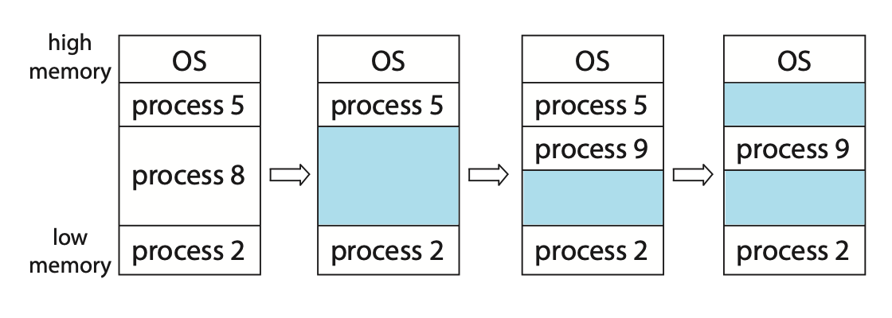
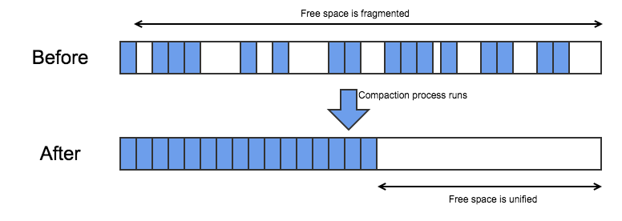
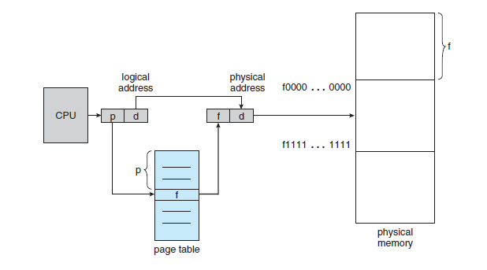
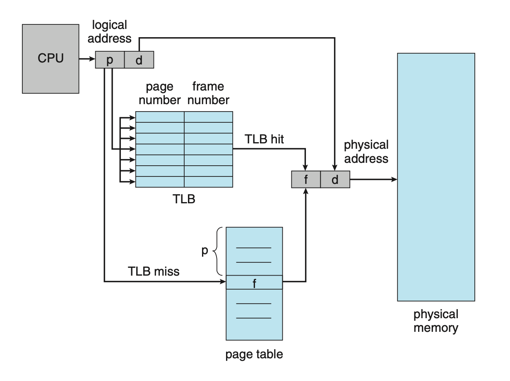

## 배경

프로세스를 수용하기 위해서는 프로그램을 메모리에 할당시켜줘야한다. 하나의 프로세스 뿐만 아니라 여러 사용자의 프로세스도 각각 목적에 맞도록 효율적으로 관리되어야한다. 이에 초기 메모리 할당법인 `연속 메모리 할당`과 현대적인 메모리 할당법인 `페이징`을 정리해볼까 한다.

## 연속 메모리 할당

메모리를 할당하는 가장 간단한 방법 중 하나는 프로세스를 메모리 가변 크기 파티션에 할당하는 것이다. 처음에는 모든 메모리를 효율적으로 사용할 수 있지만 프로세스가 종료되고 새로운 프로세스가 들어오는 과정에서 사용할 수 있는 빈공간인 `가용공간(hole)`이 생긴다. 

프로세스들을 다양한 크기의 가용공간 집합에서 적절한 크기의 가용공간을 찾아야하는 `동적 메모리 할당 문제`가 생긴다. 이러한 문제에 대한 해결책으로 다양한 기법이 있는데 아래와 같다.

- 최초 적합(first-fit)
    - 첫번째 사용 가능한 가용 공간을 할당
- 최적 적합(best-fit)
    - 사용 가능한 공간 중에서 가장 작은 것을 선택
- 최악 적합(worst-fit)
    - 가장 큰 가용 공간을 선택

### 단편화 Fragmentation

프로세스들이 메모리에 적재되고 제거되는 일이 반복되다 보면, 어떤 가용 공간은 너무 작은 조각이 되는 현상을 `단편화`라고 한다. 단편화의 종류는 2가지로 나뉜다.

- 외부 단편화
    - 메모리의 유휴공간들을 모두 합치면 충분한 공간이 되지만 너무 분산되어 있을 때 발생
- 내부 단편화
    - 프로세스가 사용하는 메모리 공간에 존재하는 남는 부분이다. 예를 들어 메모리를 2,000B로 분할해줬는데 어느 한 프로세스가 1,998B를 요구하면 2B의 가용 공간이 남는 현상을 말한다.

### 압축 compaction

외부 단편화를 해결하는 한 가지 방법으로 `압축`이 있다. 압축은 메모리 모든 내용을 한군데로 몰고 모든 가용공간을 다른 한군데로 몰아서 큰블록으로 만드는 것이다. 

그러나 압축을 항상 사용할 수 없다. 재배치가 어셈블 또는 적재 시 정적으로 행해진다면 불가능하다. 또한 압축을 하면서 드는 비용이 매우 많이 든다.

## 페이징

`페이징`은 연속 메모리 할당과 달리 프로세스의 물리 주소 공간이 연속되지 않아도 되는 기법이다. 페이징은 연속 메모리 할당에서의 문제점인 단편화와 압축의 필요성을 피한다. 

### 페이징 방법

물리 메모리는 `프레임(frame)`이라는 같은 크기의 블록으로 나뉘어진다. 논리 메모리는 `페이지(page)`라 불리는 같은 크기의 블록으로 나누어진다. CPU는 모든 주소를 `페이지 번호와 페이지 오프셋(offset)`으로 내보낸다. 그렇다면 아래와 같이 MMU를 통해서 페이지 번호로 페이지 테이블을 조회해 프레임 번호를 알아내고 오프셋을 더해 물리 메모리에 접근할 수 있게된다.

### 페이징 특징

- 페이징 자체는 일종의 동적 재배치이다. 모든 논리 주소는 페이징 하드웨어에 의해 실제 주소로 바인딩 된다.
- 외부 단편화가 발생하지 않는다. 모든 놀고 있는 프레임이 프로세스에 할당될 수 있기 때문이다.
- 내부 단편화가 발생한다. 할당은 항상 프레임의 정수배로 할당되기 때문이다.
    - 예를들어 페이지 크기가 2,048B이고 프로세스가 72,766B를 요구한다면 35개의 페이지 프레임이 할당하고 1,086B가 남는다. (72,766B - 2,048B*35 = 1,086B) 마지막 36번째로 할당되는 페이지 프레임은 2,048B - 1,086B = 962B이므로 내부 단편화가 발생한다.
- ⭐️ 메모리에 대한 프로그래머의 인식과 실제 내용이 서로 다르다는 것이다.
    - 프로그래머는 메모리가 하나의 연속적인 공간이라고 인식하지만 실제 프로그램은 여러 곳에 프레임 단위로 분산되어있다.

### 페이징 테이블를 저장하는 하드웨어 종류

- PTBR(page table base register)
    - 페이지 테이블을 메인 메모리에 저장하고 PTBR를 페이지 테이블로 가리키게 한다.
    - 다른 페이지 테이블을 사용하려면 PTBR 만 변경하면 되어 문맥교환 시간을 줄일 수 있다.
- TLB(translation look-aside buffers)
    - 특수한 소형 하드웨어 캐시다.
    - PTBR는 메모리 엑세스 시간이 느려지기 때문에 TLB라는 해결책이 나왔다.
        - PTBR 오프셋 값을 사용해 페이지 테이블 항목을 찾는다. → 메모리 엑세스 1번
        - 얻은 프레임 번호와 오프셋을 결함해 실제 주소로 접근한다. → 메모리 엑세스 1번
    - TLB는 key, value로 이뤄져있으며 페이지 번호를 캐싱하고 있다.
        - 찾고자 하는 페이지 번호가 TLB 안에 있으면 `TLB hit`
        - 찾고자 하는 페이지 번호가 없다면 `TLB miss`
    

## 참고

- 운영체제 Operating System Concepts 10판(퍼스트북, 2020)

## 출처

- 가변 파티션, 페이징 하드웨어 이미지 출처: 운영체제 10판 중
- 압축 이미지 출처: [https://nahuellofeudo.com/the-memory-hole/](https://nahuellofeudo.com/the-memory-hole/)