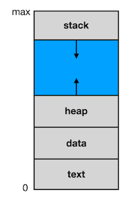
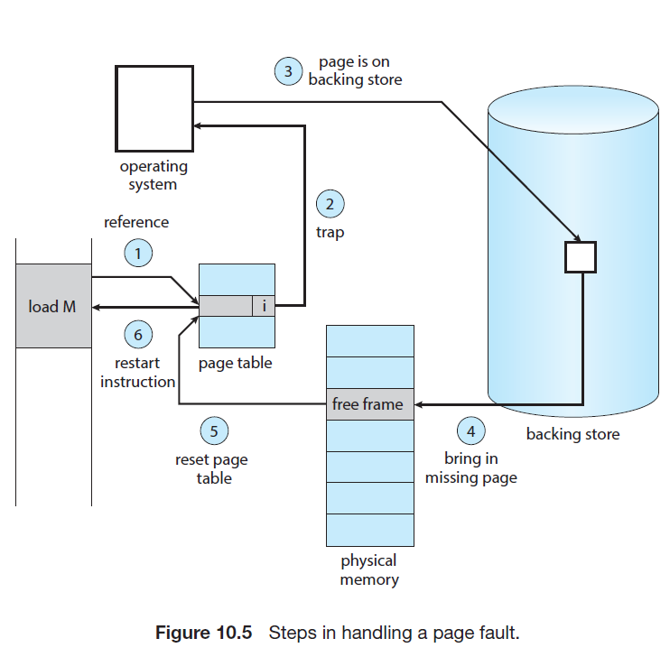

## 들어가며

이전 메모리 관리 방법들은 메모리에 얼마나 많은 프로세스를 동시에 유지할 수 있는지에 관한 방법들이다. 하지만 프로세스 전체가 메모리로 올라가는 것을 전제하고 있다. 메모리 크기에 의존하지 않고 자유로워지기 위해 쓰는 기법이 있는데 이를 `가상 메모리` 라고 한다.

## 가상 메모리 배경

사실 생각해보면 실제 프로그램들을 살펴보면 많은 경우에 프로그램 전체가 한꺼번에 메모리에 늘 올라오지 않아도 되는 것을 알 수 있다. 예를들어 몇몇가지를 설명하자면 아래와 같다.

- 많이 사용되지 않는 코드가 있다. 예를들어 잘 발생하지 않는 오류 상황을 처리하는 코드라던가 평소에 잘 사용되지 않는 기능에 관한 코드들이 있다.
- 배열, 리스트, 테이블등 필요 이상으로 많은 공간을 점유 할 수 있다. 실제로는 10x10를 사용하는 배열이 있는데 100x100으로 선언된 경우 같이 말이다.

가상 메모리를 사용해 프로그램을 일부분만 메모리에 올려놓고 실행할 수 있다면 다음과 같이 많은 이점이 있다.

- 프로그램은 물리 메모리 크기에 더는 제약 받지 않는다.
- 각 프로그램이 더 작은 메모리를 차지하므로 더 많은 프로그램을 동시에 수행할 수 있다. 이에 따라 `응답시간`은 늘어나지 않고 CPU `이용률`과 `처리율`이 높아진다.
- `스왑(swap)`하는 데 필요한 I/O 횟수가 줄어들면서 프로그램들이 빨리 실행된다.

## 가상 메모리

가상 메모리는 실제 물리 메모리 개념과 개발자의 논리 메모리 개념을 분리한 것이다. 분리 함으로써 작은 메모리를 가지고도 얼마든지 큰 가상 주소 공간을 프로그래머에게 제공할 수 있다.

`가상 주소 공간`은 한 프로세스가 메모리에 저장되는 논리적인 모습을 말한다. 일반적으로 그림과 같이 특정 논리 주소에서 0번지로 시작하여 연속적인 공간을 차지한다. heap은 동적 할당 메모리를 사용함에 따라 위로 확장, stack은 함수 호출을 거듭함에 따라 아래로 확장한다. 중간의 성긴(sparse) 주소 공간은 heap, stack의 확장 및 프로그램이 동작할때 필요한 라이브러리를 동적으로 할당해줄 때 사용된다.

가상 메모리는 이뿐만이 아니라 페이지 공유를 통해 프로세스간의 공유를 가능하게 해준다.

- 시스템 라이브러리를 여러 프로세스들에게 공유
- 메모리를 공유
- 페이지는 fork()를 통한 프로세스 생성 과정에서 공유되는 것을 가능하게 함으로써 프로세스 생성 속도를 높여준다.

## 요구 페이징 Demand Paging

프로그램 실행 시작 시 프로그램 전부를 물리 메모리에 적재하는 것이 아닌, 필요한 페이지만을 적재하는 것이 `요구 페이징` 기법이다. 페이지 테이블에 유효-무효(valid - invalid) 비트 기법으로 메모리 안의 페이지 유무를 판단한다. 

프로세스가 메모리에 올라오지 않은 페이지에 접근하기 위해서는 `페이지 폴트 트랩` 을 발생시킨다. 페이지 폴트 트랩은 페이징 하드웨어가 페이지 테이블에서 무효 비트를 발견하고 운영체제에게 트랩을 거는 현상이다. 페이지 폴트를 처리하는 과정은 아래의 그림과 같다.

이렇게 페이지 폴트가 발생하면서 프로세스에 필요한 모든 페이지가 메모리에 올라왔을 때 더이상 페이지 폴트가 일어나지 않는다. 이것을 `순수 요구 페이징(pure demand paging)`이라고 한다.

## 페이지 교체

다중 프로그래밍 정도를 더 올리면 `메모리 과할당(over-allocating)`이 발생한다. 즉 프로세스들이 필요로한 페이지가 메모리의 가용 프레임보다 많게 된다. 메모리 과할당이 되면 운영체제는 프로세스를 종료하는 등의 몇 가지 방법을 선택할 수 있다. 그 중에서 대부분 운영체제가 선택하는 방법이 페이지 교체이다.

### 기본적인 페이지 교체

사용하지 않는 프레임을 찾아 교체하는 방법

1. 디스크(보조저장장치)에서 필요한 페이지 위치를 찾는다.
2. 빈 페이지 프레임을 찾는다.
    1. 빈 프레임이 있다면 사용한다.
    2. 빈 프레임이 없다면 `희생될(victim) 프레임`을 선정한다. (선정할 때 `교체 알고리즘`들을 사용)
    3. 희생될 페이지를 디스크에 기록하고, 관련 테이블을 수정한다.
3. 빼앗은 프레임에 새 페이지를 읽어오고 테이블을 수정한다.
4. 페이지 폴트가 발생한 지점에서부터 프로세스를 계속한다.

### 페이지 교체의 특징

- **빈 프레임이 없는 경우 디스크를 두번 접근해야한다.**
    - 한 번은 프레임을 비울 때, 다른 한 번은 읽어 들일 때
    - 변경 비트(modify bit 또는 dirty bit)를 사용해 감소시킬 수 있다.
- 성능 개선을 위한 **프레임 할당 알고리즘과 페이지 교체 알고리즘 사용**
    - 프레임 할당 알고리즘: 여러 프로세스가 있을 경우 각 프로세스에 얼마나 많은 프레임을 할당해야하는지
    - 페이지 교체 알고리즘: 희생될 프레임을 어떻게 선정하는지

## 페이지 교체 알고리즘 종류

### FIFO(First-In-First-Out)

가장 먼저 들어온 페이지를 먼저 교체하는 알고리즘이다. 큐(Queue)를 사용하여 페이지를 저장하고, 새로운 페이지가 들어오면 가장 먼저 들어온 페이지를 교체한다. 간단하지만, 교체 후 페이지를 다시 사용하지 않더라도 메모리에 그대로 존재하게 된다는 단점이 있다.

### 최적 페이지 교체(Optimal Page Replacement)

앞으로 가장 오랫동안 사용하지 않을 페이지를 교체하는 알고리즘이다. 최적 페이지 교체 알고리즘은 미래를 예측하여 가장 오랫동안 사용하지 않을 페이지를 교체하기 때문에, 이론적으로 최소 페이지 부재를 보장하지만 구현하기 어렵다는 단점이 있다.

### LRU(Least Recently Used)

가장 최근에 사용되지 않은 페이지를 교체하는 알고리즘이다. 모든 페이지에 접근 시점을 기록하고, 교체할 페이지를 선택할 때, 가장 오랫동안 사용되지 않은 페이지를 교체한다. LRU 알고리즘은 최적 페이지 교체 알고리즘과 비슷한 성능을 보이기 때문에 가장 많이 사용되는 알고리즘이다.

### 계수-기반 페이지 교체 Counting-Based Page Replacemen

페이지 교체의 다른 알고리즘들은 페이지가 참조될 때마다 참조 비트를 1로 설정하고, 주기적으로 0으로 초기화한다. 이러한 방식으로 최근에 참조된 페이지를 추적하는데 이용한다.

계수-기반 페이지 교체 알고리즘은 참조 비트 대신에 각 페이지에 대한 **참조 계수(reference count)**를 유지한다. 참조 계수는 페이지에 대한 참조가 일어날 때마다 1씩 증가한다. 교체할 페이지를 결정할 때, 가장 작은 참조 계수를 가진 페이지를 교체한다.

#### LFU(Least Frequently Used)

가장 적게 사용된 페이지를 교체하는 알고리즘이다. 페이지를 사용할 때마다 카운터를 증가시키고, 교체시 가장 적게 사용된 페이지를 교체한다. LFU 알고리즘은 최적 페이지 교체 알고리즘과 유사한 성능을 보이지만, 페이지를 사용하는 패턴이 자주 바뀌는 경우 성능이 저하될 수 있다.

#### MFU(Most Frequently Used)

가장 많이 사용된 페이지를 교체하는 알고리즘이다. LFU와 반대로, 페이지를 사용할 때마다 카운터를 증가시키고, 교체시 가장 많이 사용된 페이지를 교체한다. MFU 알고리즘은 최적 페이지 교체 알고리즘과 유사한 성능을 보이지만, 페이지를 사용하는 패턴이 자주 바뀌는 경우 성능이 저하될 수 있다.

## 참고

- 운영체제 Operating System Concepts 10판(퍼스트북, 2020)