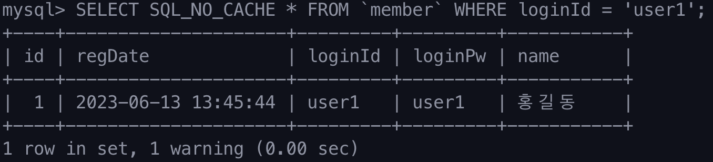

### Index란?

인덱스는 현실에서 가장 많이 쓰이는 곳은 아마 책의 목차일 것이다. 책의 소제목을 보고 몇 페이지에 원하는 내용이 있는지 알려준다. 이를 데이터베이스에서 적용한다면 인덱스란 원하는 데이터를 빠르게 찾아낼 수 있게 해주는 자료구조이다. 

### Index의 특징

데이터베이스의 테이블은 사용자가 원하는 순서대로 정렬되어 있지 않다. 예를 들어 age라는 칼럼(column)이 있다면 테이블은 나이 순서대로 데이터를 저장하고 정렬해주지 않는다. 따라서 age가 20인 데이터를 찾으려면 테이블 내 `모든 데이터를 확인(Full Scan)`해서 반환해줘야한다. 

하지만 인덱스를 활용하면 풀 스캔을 하지 않고 빠르게 원하는 데이

앞서 적었던 것처럼 인덱스를 사용하게 되면 장점이 많지만 단점도 존재한다. 데이터를 삽입, 삭제, 수정을 할 때 인덱스를 만들지 않았을 때보다 시간이 오래걸린다. 그 이유는 인덱스는 항상 정렬된 순서로 데이터를 유지하는데 변동이 생기게되면 다시 정렬을 해야하기 때문이다. 또한 인덱스는 결국 본래 데이터 테이블의 일부분을 복사하여 정렬하고 따로 저장하는 자료구조라 DBMS의 저장공간도 일부 차지하게 된다. 모든 테이블를 인덱스로 만들게 되면 메모리만 차지하고 오히려 성능을 저하시킬 수도 있다.

### Index의 특징 정리

- 원하는 데이터를 빠르게 검색 가능
- 삽입, 삭제, 수정 쿼리는 시간이 오래걸린다.
- DBMS 일부분의 메모리를 차지한다.

### Index 실습

#### 실습 환경

시작하기 전 테이블은 아래와 같다. 생성 시간과 로그인에 필요한 아이디, 패스워드, 사용자 이름으로 구성된 테이블을 생성한다.

```sql
CREATE TABLE `member` (
    id INT UNSIGNED NOT NULL AUTO_INCREMENT,
    PRIMARY KEY(id),
    regDate DATETIME NOT NULL,
    loginId CHAR(50) NOT NULL,
    loginPw VARCHAR(100) NOT NULL,
    `name` CHAR(100) NOT NULL
);
```


테이블을 생성한 이후에 UUID를 사용해 사용자 데이터를 백만개 생성해준다.

#### Index 생성 시 속도 비교

```sql
SELECT SQL_NO_CACHE *
FROM `member`
WHERE loginId = 'user1';
```

mysql 자체적으로 캐싱을 해서 속도가 높아지는 것을 대비해 `SQL_NO_CACHE` 를 걸어주어 캐싱 없이 순수 조회 속도를 비교해보고자 한다. 먼저 인덱스를 생성하지 않고 그대로 조회하면 아래와 같이 약 0.5초정도의 쿼리 수행 시간이 걸린다.


이번에는 Member 테이블에 인덱스를 생성해 조회를 해보자. 인덱스는 아래와 같은 SQL문으로 생성한다. 여기서 `UNIQUE`는 중복이 제거된 인덱스를 생성하는 것이다.

```sql
ALTER TABLE `member` ADD UNIQUE INDEX (`loginId`);
```

인덱스를 생성하고 조회했더니 0.00초로 수행되며 소숫점 2자리로도 수행속도를 나타낼 수 없을만큼 빨라졌다. 



### Index 자료구조

데이터들을 저장하기 위해서는 어떤 자료구조를 사용할까? 링크드 리스트나 배열 같은 자료구조도 있지만 실제 DBMS에서 Index는 트리 구조로 이루어져있다. 트리 자료구조를 기반으로 데이터들을 정렬하면서 범위를 절반씩 줄여나갈 수 있는 이진 탐색트리가 먼저 고안됐다.

#### 이진 탐색 트리


이진 탐색 트리는 부모 노드를 기준으로 값이 작다면 왼쪽 자식 노드로 값이 크다면 오른쪽 자식 노드로 이루어져 있는 자료구조다. `원하는 데이터를 찾고 싶을때 절반씩 소거해가며 찾을 수 있는 장점`을 지니고 있다. 하지만 이진 탐색 트리를 확장해 하나의 노드에 여러값을 넣은 뒤, 절반 이상씩 소거할 수 있는 B Tree가 있다.

#### B Tree


B Tree란 데이터베이스에서 자주 사용되는 자료구조 중 하나로, `탐색 시간을 최소화하기 위한 키-벨류 구조의 트리다.` B Tree는 `균형 이진 트리의 변형`으로 트리의 깊이를 최소화하면서 빠른 탐색을 가능하게 한다. 트리의 높이가 낮기 때문에 탐색 시간이 빠르며, 인덱스 검색 시 가장 많이 사용된다. B Tree는 각 노드마다 `다수의 자식 노드를 가질 수 있으며, 각 노드가 가지는 자료의 수에 제한이 없다.` 이런 B Tree를 좀 더 개선한 자료구조가 B+Tree다.  
  

#### B+Tree

B+Tree는 B Tree와 유사하지만, `모든 레코드는 리프 노드에만 저장`된다. 리프 노드 이외의 노드들에는 범위에 대한 정보를 가진다. 또한 마지막 리프 노드끼리 연결되어 있어서 더 빠른 탐색을 지원한다.
