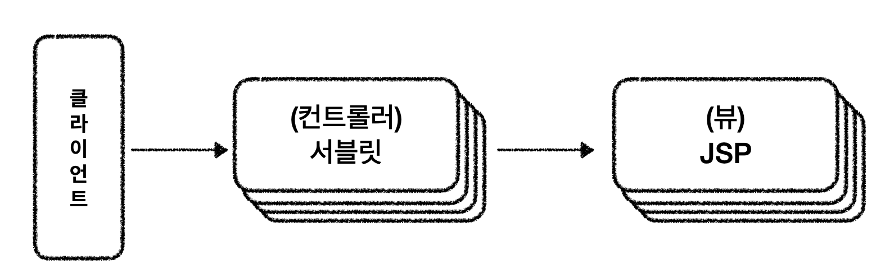
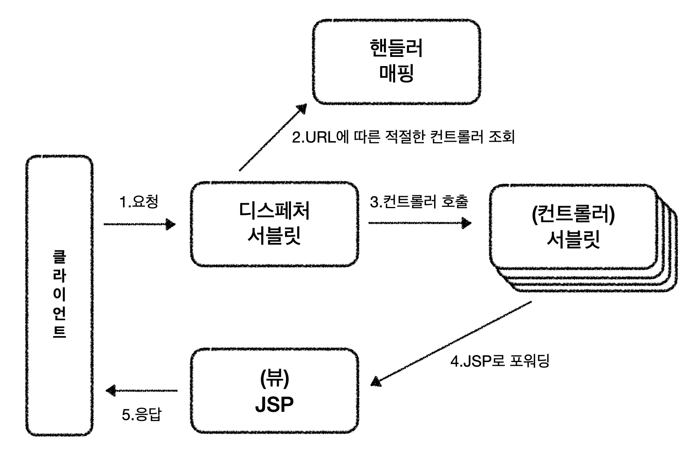
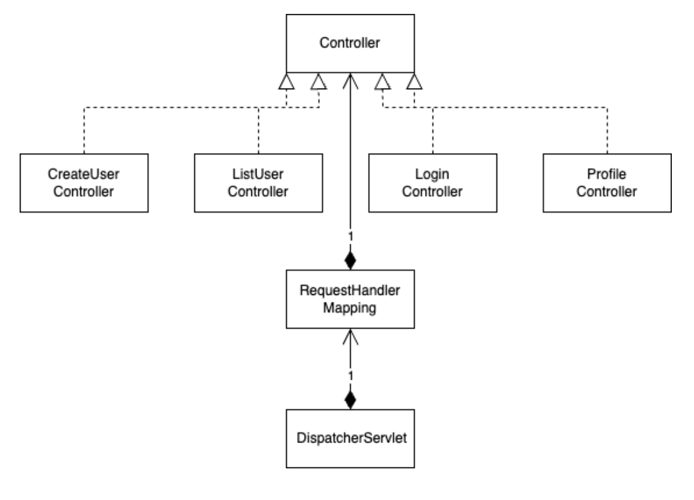

### DispatcherServlet이 없다면

여러 상황들 (로그인, 유저 목록 조회 등)을 처리하기 위해서 각각의 상황에 맞는 컨트롤러(서블릿)들이 필요하다. 새로운 상황이 생기면 또 다른 컨트롤러를 생성해야한다. 이렇게 많아지는 컨트롤러들을 관리하는데 불편함이 생기진 않을까 라는 의문이 들기 시작한다.

#### 불편함이 발생

컨트롤러들은 일반적인 애플리케이션이 하는 작업들을 하고 있다. 이런 공통된 애플리케이션 로직들이 각 컨트롤러마다 존재하게 됨으로써 코드의 중복이 발생한다. 코드의 중복은 결국 유지-보수가 힘들어진다는 뜻이다. 이를 해결할 방안으로 DispatcherServlet(디스페처 서블릿)이 등장했다.

### DispatcherServlet이란

Dispatch를 직역하면 ‘보내다’라는 뜻이다. 그렇다면 무엇을 보낸다는걸까? 디스페처 서블릿은 클라이언트에서 들어오는 모든 HTTP 요청들을 적절한 서블릿으로 보내고 처리된 반환값을 클라이언트로 보내준다. 즉, 디스페처 서블릿은 웹 애플리케이션의 전체 흐름을 조정하고, 요청-응답 라이프사이클을 관리한다. Front Controller 패턴이라고도 볼 수 있다.

#### DispatcherServlet 동작 과정

#### DispatcherServlet과 HandlerMapping

처음 디스페처 서블릿을 구현할때 이런 의문이 들었다. HandlerMapping(핸들러 매핑)이랑 차이점이 무엇인지 구분이 안되었기 때문이다. 디스페처 서블릿 내부적으로 컨트롤러 매핑을 관리하는 것이라 생각을 했다. 하지만 객체지향적인 관점으로 따로 클래스를 분리했구나 라고 이해하며 넘어갔다. 클래스 다이어그램을 그려보면서 각 클래스의 연관관계를 잘 

### 클래스 다이어그램

### 참고

- 헤드 퍼스트 서블릿, JSP, 2005
- https://mangkyu.tistory.com/18